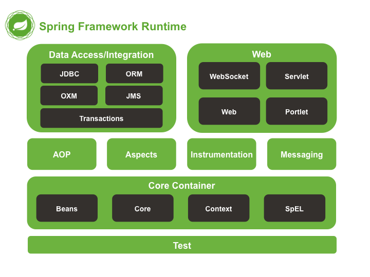
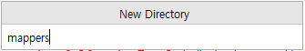

# 01. Spring Framework 개요

<br>

## 01-01. Spring 역사
- EJB를 주 프레임워크로 사용할 때 불편했던 점들(무거움, 따라야 할 스펙들이 복잡함)을 해소하기 위해 탄생함
- 2002년 로드존슨이 출판한 도서 Expert One-on-One J2EE Design and Development에 선보인 코드가 현재 Spring의 근간이 됨
- 이 도서를 읽은 개발자들이 '코드가 책으로만 존재하기에는 너무 아깝다'라며 로드 존슨의 허가를 받은 뒤 프레임워크로 발전시킴
- 2003년 6월 Apache 2.0 License로 공개됨
- 2004년에 1.0v이 배포됨

<br>

## 01-02. Spring Framework란?
- 자바, 엔터프라이즈 개발, 오픈소스, light-weigth "애플리케이션 프레임워크"이다.
- 특정 계층이나 기술, 업무 분야에 국한되지 않고 애플리케이션의 전 영역을 포괄하는 범용적인 프레임워크를 말함.
- 굉장히 범용적이고 다양한 분야에서 활용하고 있지만, 모두 다 알아야 활용할 수 있는 것은 아닌 만큼 기본에 충실해서 학습해야 합니다.

### 1) 경량급 프레임워크
- 단순한 웹 컨테이너에서도 엔터프라이즈 개발의 고급기술을 대부분 사용할 수 있습니다.
- EJB에 비해 경량급입니다. 또한 일반 자바 객체만을 사용하여 엔터프라이즈급의 고급 기술을 구현할 수 있습니다.

### 2) 엔터프라이즈 개발 용이
- 개발자가 복잡하고 실수하기 쉬운 Low Level에 많이 신경 쓰지 않으면서 Business Logic 개발에 전념할 수 있도록 해줍니다.

### 3) 오픈소스
- Spring은 OpenSource 로서 누구나 사용할 수 있습니다. 다만, 아무나 잘 하는 것은 아니며, 무료 프레임워크의 단점을 극복하고, 장점을 극대화하여 사용하여하여 합니다.

<br>


## 01-03. Spring Framework 특징
### 1) 컨테이너 제공
- Spring 컨테이너(Container)는 Java 객체의 Life Cycle을 관리하며, Spring 컨테이너(Container)로부터 필요한 객체를 가져와 사용할 수 있습니다.

### 2) DI(Dependency Injection) 지원
- Spring은 설정 파일이나 어노테이션(Annotation)을 통해서 객체 간의 의존관계를 설정할 수 있도록 하고 있습니다.

### 3) AOP(Aspect Oriented Programming) 지원
- Spring은 트랜잭션(Transaction)이나 로깅(Logging), 보안(Security)과 같이 공통적으로 필요로 하는 모듈들을 실제 핵심 모듈에서 분리해서 적용할 수 있습니다.

### 4) POJO(Plain Old Java Object) 지원
- Sring 컨테이너(Container)에 저장되는 Java객체는 특정한 인터페이스(Interface)를 구현하거나, 특정 클래스(Class)를 상속받지 않아도 됩니다.

### 5) 트랜잭션(Transaction) 처리를 위한 일관된 방법을 지원
- JDBC(Java DataBase Connectivity), JTA(Java Transaction API) 등 어떤 트랜잭션을 사용하더라도 설정(Configuration)을 통해 정보를 관리하므로 트랜잭션 구현에 상관없이 동일한 코드를 사용할 수 있습니다.

### 6) 영속성(Persistence)과 관련된 다양한 API 지원
- Spring은 Mybatis, Hibernate 등 데이터베이스 처리를 위한 ORM(Object Relational Mapping) 프레임워크들과의 연동 지원합니다.

<br>

## 01-04. Spring Framework 주요 모듈 구성



### 1) Data Access/Integration(데이터 접근 및 통합)

JDBC(Java DataBase Connectivity) : Java 기반 애플리케이션의 데이터를 데이터베이스에 저장 및 업데이트하거나, 데이터베이스에 저장된 데이터를 Java에서 사용할 수 있도록 하는 자바 API입니다.

ORM(Object Relational Mpping) : 객체와 관계형 데이터베이스의 데이터를 자동으로 매핑(연결)해주는 것을 말합니다.

OXM(Object-XML Mapping) : XML과 자바(Java) 오브젝트를 매핑해서 상호 변환해주는 기술입니다.

JMS(Java Message Service) : 사람이 아닌 애플리케이션의 구성 요소가 소비하는 요청, 보고서, 이벤트로 메시지를 작성, 전송 수신 및 읽을 수 있는 메시징 서비스를 제공하는 것을 말합니다.

Transactions : 데이터베이스에서 여러 요청이 한 꺼번에 처리가 되어야 하는 트랜잭션(Transaction)이 정의되고, 구현될 수 있도록 어노테이션으로 제공합니다.

<br>

### 2) Web
- Websocket :  HTTP 통신의 단점인 단방향 통신을 개선하기 위하여 웹 소켓을 활용하여 반 영구적인 양방향 통신을 제공합니다.
- Servlet : MVC 처리 패턴에서 Controller에 해당하는 요청에 대한 처리 작업이 진행되도록 합니다.
- Web : JSP(Java Server Page)에 속하는 Expression, Directive, Declaration, Expression Language, Java Standard Tag Library 등을 활용할 수 있는 웹 모듈을 제공합니다.
- Portlet : 포털 페이지를 구성하는 웹 컴포넌트(Web Component)를 제공하며, 또한, MVC 처리 패턴에서 View 속하는 곳에 데이터를 처리하여 보내 질 수 있는 역할을 수행합니다.

<br>

### 3) Core Container
- 주요한 객체들(Bean)을 관리해주는 아주 중요한 모듈
- Beans : 스프링 컨테이너에 의해 관리되는 재사용 가능한 소프트웨어 컴포넌트로서 하나의 클래스로 부터 얻어진 객체이며, 주입(Inject)의 대상입니다. XML의 bean 태그나 @Configuration 어노테이션으로 설정되는 주입 설정 클래스에서 @Bean 어노테이션으로 설정됩니다.
- Core : 스프링 프레임워크의 근간이 되는 요소로 IoC(Invert Of Control) 또는 DI(Dependency Injection)기능을 지원하는 요소입니다.
- Context : 여러 Bean을 관련있는 요소로 각 각 분리하여 하나의 XML 파일로 구성될 수 있도록 하는 요소입니다.
- SpEL : Spring Expresion Language의 약자로 런타임(실행) 시 객체 그래프 쿼리 및 조작을 지원하는 표현 언어로서 #{표현식} 이나 ${표현식} 으로된 파라미터나 연산식, 비교식 등을 구현할 수 있도록 돕습니다.

### 4) Test
- JUnit 및 Spring Test 를 지원합니다.
- JUnit은 @Test, @Ignore, @Before, @After, @BeforeClass, @AfterClass 등의 어노테이션을 활용한 assert 메서드로 단위 테스트 프레임을 구성을 지원합니다.
- Spring Test는 @RunWith, @ContextConfiguration, @Autowired 어노테이션을 활용하여 별도의 컨텍스트 없이도 테스트 케이스를 작성할 수 있도록 지원합니다.

### 5) Spring Object
- AOP(Aspect-Oriented Programming) : 공통적으로 적용이 되어야 하는 부분이 여러 군데에 흩어져 있을 경우 사용시기(Jointpoint)가 되었을 경우 대비해 여러 사용시기(Jointpoint)를 정규 표현식인 포인트컷(Pointcut)으로 만들어 각 각의 대상 클래스에 있는 코드를 연결하여 하나의 객체로 만드는데 이를 위빙(Weaving)이라 하고, 위빙(Weaving) 된 것을 동작되도록 합니다. 이 때 위빙(Weaving)된 동작을 어드바이스(Advice)라고 합니다.
- Aspects : 보통 AspectJ에 의한 관점지향 프로그래밍을 의미하며, Spring AOP는 공통적인 문제를 해결하기 위해 간단히 구현하고, Spring Container에 의해 관리되는 Bean에만 적용하지만, Aspects는 Spring AOP보다 강력하고, 완전체를 별도로 구성하여 진행하기 때문에 많이 복잡해집니다.
- Instrumentation : 빈의 생명주기와 설정 그리고 처리방법을 관리하는 스프링 컨테이너입니다.
- Messaging : 시스템의 구성 요소 간에 메시징을 지원하고 관리하는 요소입니다.

<br>

## 01-05. Spring Framework 의 개발환경 설정

### 1) Open JDK 설치

https://www.azul.com/downloads/?package=jdk#zulu


위 사이트에 접속하여 Open JDK 17 버전의 Windows
x86 64-bit용으로 다운로드 받은 후 설치합니다.


### 2) 인텔리제이 설치

https://www.jetbrains.com/ko-kr/idea/download/?section=windows

위 사이트에 접속하여 인텔리 제이를 다운로드 받아 설치합니다.


### 3) 인텔리제이 프로젝트 생성

#### 3-1) 새로운 프로젝트 생성


#### 3-2) 새로운 프로젝트 설정


#### 3-3) 새로운 프로젝트 라이브러리 로딩 설정


#### 3-4) D:\kim\springStudy\study1\pom.xml 기본 설정

```xml
<project xmlns="http://maven.apache.org/POM/4.0.0" xmlns:xsi="http://www.w3.org/2001/XMLSchema-instance"
  xsi:schemaLocation="http://maven.apache.org/POM/4.0.0 http://maven.apache.org/maven-v4_0_0.xsd">
  <modelVersion>4.0.0</modelVersion>
  <groupId>kr.co.study</groupId>
  <artifactId>study</artifactId>
  <packaging>war</packaging>
  <version>1.0-SNAPSHOT</version>
  <name>study Maven Webapp</name>
  <url>http://maven.apache.org</url>
  <properties>
    <java-version>17</java-version>
    <org.springframework-version>5.3.20</org.springframework-version>
    <org.aspectj-version>1.9.0</org.aspectj-version>
    <org.slf4j-version>2.0.0</org.slf4j-version>
  </properties>
  <dependencies>
    <dependency>
      <groupId>org.springframework</groupId>
      <artifactId>spring-context</artifactId>
      <version>${org.springframework-version}</version>
      <exclusions>
        <exclusion>
          <groupId>commons-logging</groupId>
          <artifactId>commons-logging</artifactId>
        </exclusion>
      </exclusions>
    </dependency>
    <dependency>
      <groupId>org.springframework</groupId>
      <artifactId>spring-webmvc</artifactId>
      <version>${org.springframework-version}</version>
    </dependency>

    <dependency>
      <groupId>org.aspectj</groupId>
      <artifactId>aspectjrt</artifactId>
      <version>1.9.0</version>
    </dependency>

     </dependencies>
  <build>
    <finalName>study1</finalName>
    <plugins>
      <plugin>
        <artifactId>maven-eclipse-plugin</artifactId>
        <version>2.9</version>
        <configuration>
          <additionalProjectnatures>
            <projectnature>org.springframework.ide.eclipse.core.springnature</projectnature>
          </additionalProjectnatures>
          <additionalBuildcommands>
            <buildcommand>org.springframework.ide.eclipse.core.springbuilder</buildcommand>
          </additionalBuildcommands>
          <downloadSources>true</downloadSources>
          <downloadJavadocs>true</downloadJavadocs>
        </configuration>
      </plugin>
      <plugin>
        <groupId>org.apache.maven.plugins</groupId>
        <artifactId>maven-compiler-plugin</artifactId>
        <version>2.5.1</version>
        <configuration>
          <source>17</source>
          <target>17</target>
          <compilerArgument>-Xlint:all</compilerArgument>
          <showWarnings>true</showWarnings>
          <showDeprecation>true</showDeprecation>
        </configuration>
      </plugin>
      <plugin>
        <groupId>org.codehaus.mojo</groupId>
        <artifactId>exec-maven-plugin</artifactId>
        <version>1.2.1</version>
        <configuration>
          <mainClass>org.test.int1.Main</mainClass>
        </configuration>
      </plugin>
    </plugins>
  </build>
</project>
```

#### 3-5) 톰캣 서버 다운로드


#### 3-5) 톰캣 서버 설정 및 실행


<br><br>

# 02. Spring Framework 설정

## 02-1. 의존성 설정

D:\kim\springStudy\study2\pom.xml 설정

```xml
<project xmlns="http://maven.apache.org/POM/4.0.0" xmlns:xsi="http://www.w3.org/2001/XMLSchema-instance"
  xsi:schemaLocation="http://maven.apache.org/POM/4.0.0 http://maven.apache.org/maven-v4_0_0.xsd">
  <modelVersion>4.0.0</modelVersion>
  <groupId>org.study2</groupId>
  <artifactId>study2</artifactId>
  <packaging>war</packaging>
  <version>1.0-SNAPSHOT</version>
  <name>study2 Maven Webapp</name>
  <url>http://maven.apache.org</url>
  <properties>
    <java-version>17</java-version>
    <org.springframework-version>5.3.20</org.springframework-version>
    <org.slf4j-version>2.0.0</org.slf4j-version>
  </properties>
  <dependencies>
    <dependency>
      <groupId>org.springframework</groupId>
      <artifactId>spring-context</artifactId>
      <version>${org.springframework-version}</version>
      <exclusions>
        <exclusion>
          <groupId>commons-logging</groupId>
          <artifactId>commons-logging</artifactId>
        </exclusion>
      </exclusions>
    </dependency>
    <dependency>
      <groupId>org.springframework</groupId>
      <artifactId>spring-webmvc</artifactId>
      <version>${org.springframework-version}</version>
    </dependency>
    <dependency>
      <groupId>org.aspectj</groupId>
      <artifactId>aspectjrt</artifactId>
      <version>1.9.0</version>
    </dependency>

    <!-- slf4j and log4j -->
    <dependency>
      <groupId>org.slf4j</groupId>
      <artifactId>slf4j-api</artifactId>
      <version>${org.slf4j-version}</version>
    </dependency>
    <dependency>
      <groupId>org.slf4j</groupId>
      <artifactId>jcl-over-slf4j</artifactId>
      <version>${org.slf4j-version}</version>
      <scope>runtime</scope>
    </dependency>
    <dependency>
      <groupId>org.slf4j</groupId>
      <artifactId>slf4j-log4j12</artifactId>
      <version>${org.slf4j-version}</version>
      <scope>runtime</scope>
    </dependency>
    <dependency>
      <groupId>log4j</groupId>
      <artifactId>log4j</artifactId>
      <version>1.2.15</version>
      <exclusions>
        <exclusion>
          <groupId>javax.mail</groupId>
          <artifactId>mail</artifactId>
        </exclusion>
        <exclusion>
          <groupId>javax.jms</groupId>
          <artifactId>jms</artifactId>
        </exclusion>
        <exclusion>
          <groupId>com.sun.jdmk</groupId>
          <artifactId>jmxtools</artifactId>
        </exclusion>
        <exclusion>
          <groupId>com.sun.jmx</groupId>
          <artifactId>jmxri</artifactId>
        </exclusion>
      </exclusions>
      <scope>runtime</scope>
    </dependency>

    <!-- 의존성 주입 라이브러리 - @Inject -->
    <dependency>
      <groupId>javax.inject</groupId>
      <artifactId>javax.inject</artifactId>
      <version>1</version>
    </dependency>

    <!-- 서블릿(servlet-api 2.5, jsp-api 2.1, jstl 1.2) -->
    <dependency>
      <groupId>javax.servlet</groupId>
      <artifactId>servlet-api</artifactId>
      <version>2.5</version>
      <scope>provided</scope>
    </dependency>
    <dependency>
      <groupId>javax.servlet.jsp</groupId>
      <artifactId>jsp-api</artifactId>
      <version>2.1</version>
      <scope>provided</scope>
    </dependency>
    <dependency>
      <groupId>javax.servlet</groupId>
      <artifactId>jstl</artifactId>
      <version>1.2</version>
    </dependency>

    <!-- 테스트 도구(junit 4.13, spring-test 5.3.20)   -->
    <dependency>
      <groupId>junit</groupId>
      <artifactId>junit</artifactId>
      <version>4.13</version>
      <scope>test</scope>
    </dependency>
    <dependency>
      <groupId>org.springframework</groupId>
      <artifactId>spring-test</artifactId>
      <version>${org.springframework-version}</version>
    </dependency>

    <!-- maven build tool(3.2.1) -->
    <dependency>
      <groupId>org.apache.maven.plugins</groupId>
      <artifactId>maven-archetype-plugin</artifactId>
      <version>3.2.1</version>
    </dependency>

    <!-- lombok(1.18.22)-->
    <dependency>
      <groupId>org.projectlombok</groupId>
      <artifactId>lombok</artifactId>
      <version>1.18.22</version>
    </dependency>

    <!-- DB 로그(log4jdbc-log4j2 1.16) -->
    <dependency>
      <groupId>org.bgee.log4jdbc-log4j2</groupId>
      <artifactId>log4jdbc-log4j2</artifactId>
      <version>1.16</version>
    </dependency>

    <!-- 스프링 jdbc(5.3.20)-->
    <dependency>
      <groupId>org.springframework</groupId>
      <artifactId>spring-jdbc</artifactId>
      <version>${org.springframework-version}</version>
    </dependency>

    <!-- DBMS Common Library(1.4) -->
    <dependency>
      <groupId>commons-dbcp</groupId>
      <artifactId>commons-dbcp</artifactId>
      <version>1.4</version>
    </dependency>

    <!-- 마리아DB 연결 라이브러리(3.1.4) -->
    <dependency>
      <groupId>org.mariadb.jdbc</groupId>
      <artifactId>mariadb-java-client</artifactId>
      <version>3.1.4</version>
    </dependency>

    <!-- 스프링 트랜잭션 도구(5.3.20) -->
    <dependency>
      <groupId>org.springframework</groupId>
      <artifactId>spring-tx</artifactId>
      <version>${org.springframework-version}</version>
    </dependency>

    <!-- mybatis 라이브러리 - mybatis 3.4.0 -->
    <dependency>
      <groupId>org.mybatis</groupId>
      <artifactId>mybatis</artifactId>
      <version>3.4.0</version>
    </dependency>

    <!-- mybatis-spring 1.3.2 -->
    <dependency>
      <groupId>org.mybatis</groupId>
      <artifactId>mybatis-spring</artifactId>
      <version>1.3.2</version>
    </dependency>

    <!-- 구글 JSON : gson 2.7 -->
    <dependency>
      <groupId>com.google.code.gson</groupId>
      <artifactId>gson</artifactId>
      <version>2.7</version>
    </dependency>

    <!-- 웹 크롤링 도구 jsoup 1.12.1 -->
    <dependency>
      <groupId>org.jsoup</groupId>
      <artifactId>jsoup</artifactId>
      <version>1.12.1</version>
    </dependency>

    <!-- 범용 json(20200518) -->
    <dependency>
      <groupId>org.json</groupId>
      <artifactId>json</artifactId>
      <version>20200518</version>
    </dependency>

    <!-- 심플 json(0.4) -->
    <dependency>
      <groupId>org.apache.clerezza.ext</groupId>
      <artifactId>org.json.simple</artifactId>
      <version>0.4</version>
    </dependency>

    <!-- jackson library(json to xml) 2.9.4-->
    <dependency>
      <groupId>com.fasterxml.jackson.core</groupId>
      <artifactId>jackson-databind</artifactId>
      <version>2.9.4</version>
    </dependency>

    <!-- jackson mapper(1.9.13) -->
    <dependency>
      <groupId>org.codehaus.jackson</groupId>
      <artifactId>jackson-mapper-asl</artifactId>
      <version>1.9.13</version>
    </dependency>

    <!-- 스프링 암호화 라이브러리 -->
    <dependency>
      <groupId>org.springframework.security</groupId>
      <artifactId>spring-security-core</artifactId>
      <version>5.4.0</version>
    </dependency>
    <dependency>
      <groupId>org.springframework.security</groupId>
      <artifactId>spring-security-web</artifactId>
      <version>5.4.0</version>
    </dependency>
    <dependency>
      <groupId>org.springframework.security</groupId>
      <artifactId>spring-security-config</artifactId>
      <version>5.4.0</version>
    </dependency>

    <!-- 파일 첨부 및 업로드 라이브러리 commons-fileupload 1.3.2, commons-io 2.4  -->
    <dependency>
      <groupId>commons-fileupload</groupId>
      <artifactId>commons-fileupload</artifactId>
      <version>1.3.2</version>
    </dependency>
    <dependency>
      <groupId>commons-io</groupId>
      <artifactId>commons-io</artifactId>
      <version>2.4</version>
    </dependency>

    <!--  이미지 편집 라이브러리 imgscalr-lib 4.0 -->
    <dependency>
      <groupId>org.imgscalr</groupId>
      <artifactId>imgscalr-lib</artifactId>
      <version>4.0</version>
    </dependency>

    <!-- 자바 이메일 기본 라이브러리 javax.mail-api 1.4.7 -->
    <dependency>
      <groupId>javax.mail</groupId>
      <artifactId>javax.mail-api</artifactId>
      <version>1.4.7</version>
    </dependency>

    <!-- 이메일 및 자원에 대한 외부 송출 라이브러리 spring-context-support 스프링mvc 버전과 동일 -->
    <dependency>
      <groupId>org.springframework</groupId>
      <artifactId>spring-context-support</artifactId>
      <version>${org.springframework-version}</version>
    </dependency>

    <!-- java의 validation 라이브러리 validation-api 2.0.1.Final -->
    <dependency>
      <groupId>javax.validation</groupId>
      <artifactId>validation-api</artifactId>
      <version>2.0.1.Final</version>
    </dependency>

    <!-- 폼 검증을 애노테이션으로 검증하는 라이브러리 hibernate-annotations 3.5.6-Final -->
    <dependency>
      <groupId>org.hibernate</groupId>
      <artifactId>hibernate-annotations</artifactId>
      <version>3.5.6-Final</version>
    </dependency>

    <!-- hibernate Validator 라이브러리 hibernate-validator 6.0.8.Final, jaxb-api 2.3.0 -->
    <dependency>
      <groupId>org.hibernate.validator</groupId>
      <artifactId>hibernate-validator</artifactId>
      <version>6.0.8.Final</version>
    </dependency>
    <dependency>
      <groupId>javax.xml.bind</groupId>
      <artifactId>jaxb-api</artifactId>
      <version>2.3.0</version>
    </dependency>
    <dependency>
      <groupId>org.junit.jupiter</groupId>
      <artifactId>junit-jupiter</artifactId>
      <version>RELEASE</version>
      <scope>compile</scope>
    </dependency>

    <!-- 애노테이션 설정 api 추가 -->
    <dependency>
      <groupId>javax.annotation</groupId>
      <artifactId>javax.annotation-api</artifactId>
      <version>1.3.2</version>
    </dependency>

    <!-- 음력 달력 -->
    <dependency>
      <groupId>com.ibm.icu</groupId>
      <artifactId>icu4j</artifactId>
      <version>4.0.1</version>
    </dependency>

  </dependencies>
  <build>
    <finalName>study2</finalName>
    <plugins>
      <plugin>
        <artifactId>maven-eclipse-plugin</artifactId>
        <version>2.9</version>
        <configuration>
          <additionalProjectnatures>
            <projectnature>org.springframework.ide.eclipse.core.springnature</projectnature>
          </additionalProjectnatures>
          <additionalBuildcommands>
            <buildcommand>org.springframework.ide.eclipse.core.springbuilder</buildcommand>
          </additionalBuildcommands>
          <downloadSources>true</downloadSources>
          <downloadJavadocs>true</downloadJavadocs>
        </configuration>
      </plugin>
      <plugin>
        <groupId>org.apache.maven.plugins</groupId>
        <artifactId>maven-compiler-plugin</artifactId>
        <version>2.5.1</version>
        <configuration>
          <source>17</source>
          <target>17</target>
          <compilerArgument>-Xlint:all</compilerArgument>
          <showWarnings>true</showWarnings>
          <showDeprecation>true</showDeprecation>
        </configuration>
      </plugin>
      <plugin>
        <groupId>org.codehaus.mojo</groupId>
        <artifactId>exec-maven-plugin</artifactId>
        <version>1.2.1</version>
        <configuration>
          <mainClass>org.test.int1.Main</mainClass>
        </configuration>
      </plugin>
    </plugins>
  </build>
</project>
```

## 02-2. 웹 설정

D:\kim\springStudy\study2\src\main\webapp\WEB-INF\web.xml 의 설정

```xml
<?xml version="1.0" encoding="UTF-8"?>
<web-app version="2.5" xmlns="http://java.sun.com/xml/ns/javaee"
         xmlns:xsi="http://www.w3.org/2001/XMLSchema-instance"
         xsi:schemaLocation="http://java.sun.com/xml/ns/javaee https://java.sun.com/xml/ns/javaee/web-app_2_5.xsd">
  <display-name>Study2 Web Application</display-name>

  <!-- 빈 설정 파일 등록 : applicationContext.xml 지정 -->
  <context-param>
    <param-name>contextConfigLocation</param-name>
    <param-value>/WEB-INF/applicationContext.xml</param-value>
  </context-param>

  <!-- 모든 서블릿과 필터가 공유하는 Context Spring 컨테이너 생성 -->
  <listener>
    <listener-class>org.springframework.web.context.ContextLoaderListener</listener-class>
  </listener>

  <!-- 내부 웹 관련 처리 작업 설정 파일 등록 : dispatcher-servlet.xml 지정 -->
  <!-- 암호화 처리 설정 파일 등록 : spring-security.xml 지정 -->
  <servlet>
    <servlet-name>appServlet</servlet-name>
    <servlet-class>org.springframework.web.servlet.DispatcherServlet</servlet-class>
    <init-param>
      <param-name>contextConfigLocation</param-name>
      <param-value>
        /WEB-INF/dispatcher-servlet.xml
        /WEB-INF/spring-security.xml
      </param-value>
    </init-param>
    <load-on-startup>1</load-on-startup>
  </servlet>

  <servlet-mapping>
    <servlet-name>appServlet</servlet-name>
    <url-pattern>/</url-pattern>
  </servlet-mapping>

  <!-- 한글 깨짐 방지 -->
  <filter>
    <filter-name>encodingFilter</filter-name>
    <filter-class>org.springframework.web.filter.CharacterEncodingFilter</filter-class>
    <init-param>
      <param-name>encoding</param-name>
      <param-value>UTF-8</param-value>
    </init-param>
  </filter>
  <filter-mapping>
    <filter-name>encodingFilter</filter-name>
    <url-pattern>/*</url-pattern>
  </filter-mapping>
</web-app>
```

<br><br>

## 02-3. 애플리케이션 빈 등록 및 설정

D:\kim\springStudy\study2\src\main\webapp\WEB-INF\applicationContext.xml

### 1) applicationContext.xml 생성

- D:\kim\springStudy\study2\src\main\webapp\WEB-INF 디렉토리에서 마우스 오른쪽 버튼 을 누르고 나오는 메뉴에서 [New]-[File] 을 선택하고, 입력 란에 applicationContext.xml을 입력하고, Enter를 칩니다.


<br>


### 2) applicationContext.xml 작성

```xml
<?xml version="1.0" encoding="UTF-8"?>
<beans xmlns="http://www.springframework.org/schema/beans"
       xmlns:xsi="http://www.w3.org/2001/XMLSchema-instance"
       xmlns:mybatis-spring="http://mybatis.org/schema/mybatis-spring"
       xmlns:context="http://www.springframework.org/schema/context"
       xmlns:aop="http://www.springframework.org/schema/aop"
       xmlns:jdbc="http://www.springframework.org/schema/jdbc"
       xmlns:tx="http://www.springframework.org/schema/tx"
       xsi:schemaLocation="http://www.springframework.org/schema/jdbc http://www.springframework.org/schema/jdbc/spring-jdbc-4.3.xsd
		http://mybatis.org/schema/mybatis-spring http://mybatis.org/schema/mybatis-spring-1.2.xsd
		http://www.springframework.org/schema/beans https://www.springframework.org/schema/beans/spring-beans.xsd
		http://www.springframework.org/schema/context http://www.springframework.org/schema/context/spring-context-4.3.xsd
		http://www.springframework.org/schema/aop http://www.springframework.org/schema/aop/spring-aop-4.3.xsd
		http://www.springframework.org/schema/tx http://www.springframework.org/schema/tx/spring-tx-4.3.xsd">

<!-- applicationContext : 빈을 설정하는 파일로 외부 자원과 연동하는 부분을 설정 -->

    <!-- 데이터베이스 설정 -->
    <!-- spring-jdbc-5.3.20.jar 안의 드라이버매니저 연결 -->
    <bean id="dataSource" class="org.springframework.jdbc.datasource.SimpleDriverDataSource">
        <property name="driverClass" value="org.mariadb.jdbc.Driver"/>
        <property name="url" value="jdbc:mariadb://localhost:3306/haebeop"/>
        <property name="username" value="root"/>
        <property name="password" value="1234"/>
    </bean>

    <!-- sql을 대신할 my-batis 설정 : mybatis-spring-1.3.2.jar의 세션팩토리빈클래스 연결 -->
    <bean id="sqlSessionFactory" class="org.mybatis.spring.SqlSessionFactoryBean">
        <property name="dataSource" ref="dataSource"/>
        <property name="configLocation" value="classpath:/mybatis-config.xml"/>
        <property name="mapperLocations" value="classpath*:/mappers/**/*Mapper.xml"/>
    </bean>

    <!-- SqlSession 객체 주입 -->
    <bean id="sqlSession" class="org.mybatis.spring.SqlSessionTemplate" destroy-method="clearCache">
        <constructor-arg name="sqlSessionFactory" ref="sqlSessionFactory"/>
    </bean>

    <!-- 트랜잭션 및 DB 패키지 방안 및 각 종 로깅과 보안 설정 -->
    <bean id="transactionManager" class="org.springframework.jdbc.datasource.DataSourceTransactionManager">
        <property name="dataSource" ref="dataSource"/>
    </bean>

    <context:annotation-config/>

    <!-- @Transactional 어노테이션 처리 -->
    <tx:annotation-driven transaction-manager="transactionManager"/>


</beans>
```

<br>

## 02-4. 맵퍼 등록 및 설정

### 1) mybatis-config.xml 파일 생성

D:\kim\springStudy\study2\src\main\resources 디렉토리에서 마우스 오른쪽 버튼 을 누르고 나오는 메뉴에서 [New]-[File] 을 선택하고, 입력 란에 mybatis-config.xml을 입력하고, Enter를 칩니다.


<br>


### 2) mybatis-config.xml 파일 작성

```xml
<?xml version="1.0" encoding="UTF-8"?>
<!DOCTYPE configuration PUBLIC
        "-//mybatis.org//DTD Config 3.0//EN"
        "http://mybatis.org/dtd/mybatis-3-config.dtd">
<configuration>
    <typeAliases>
        <package name="kr.ed.haebeop" />
    </typeAliases>
</configuration>
```

<br>

### 3) mappers 디렉토리 생성 및 파일 작성

- D:\kim\springStudy\study2\src\main\resources 디렉토리에서 마우스 오른쪽 버튼 을 누르고 나오는 메뉴에서 [New]-[Directory] 를 선택하고, 입력 란에 mappers을 입력하고, Enter를 칩니다.




- D:\kim\springStudy\study2\src\main\resources\mappers 디렉토리에서 마우스 오른쪽 버튼 을 누르고 나오는 메뉴에서 [New]-[File] 을 선택하고, 입력 란에 testMapper.xml을 입력하고, Enter를 칩니다.


```xml
<?xml version="1.0" encoding="UTF-8"?>
<!DOCTYPE mapper
        PUBLIC "-//mybatis.org//DTD Mapper 3.0//EN"
        "http://mybatis.org/dtd/mybatis-3-mapper.dtd">
<mapper namespace="test">
    <select id="testSelectList" resultType="kr.ed.haebeop.domain.test">
        select * from test
    </select>
</mapper>
```

<br><br>

## 02-5. 서블릿 등록 및 설정

### 1) 서블릿 디스패처 작성 - dispatcher-servlet.xml 작성

- D:\kim\springStudy\study2\src\main\webapp\WEB-INF 디렉토리에서 마우스 오른쪽 버튼 을 누르고 나오는 메뉴에서 [New]-[File] 를 선택하고, 입력 란에 dispatcher-servlet.xml을 입력하고, Enter를 칩니다.


```xml
<?xml version="1.0" encoding="UTF-8"?>
<beans:beans xmlns="http://www.springframework.org/schema/mvc"
             xmlns:xsi="http://www.w3.org/2001/XMLSchema-instance"
             xmlns:beans="http://www.springframework.org/schema/beans"
             xmlns:context="http://www.springframework.org/schema/context"
             xsi:schemaLocation="http://www.springframework.org/schema/mvc https://www.springframework.org/schema/mvc/spring-mvc.xsd
		http://www.springframework.org/schema/beans https://www.springframework.org/schema/beans/spring-beans.xsd
		http://www.springframework.org/schema/context https://www.springframework.org/schema/context/spring-context.xsd">

    <!-- dispatcher-servlet.xml : 내부 웹 접근 및 처리 작업 설정 파일 -->

    <!--  접근 자원에 대한 권한 설정 -->
    <resources mapping="/resources/**" location="/resources/" />
    <resources mapping="/data/**" location="/data/" />
    <resources mapping="/admin/**" location="/WEB-INF/views/admin" />
    <resources mapping="/board/**" location="/WEB-INF/views/board" />
    <resources mapping="/check/**" location="/WEB-INF/views/check" />
    <resources mapping="/guestbook/**" location="/WEB-INF/views/guestbook" />
    <resources mapping="/free/**" location="/WEB-INF/views/free" />
    <resources mapping="/include/**" location="/WEB-INF/views/include" />
    <resources mapping="/member/**" location="/WEB-INF/views/member" />
    <resources mapping="/notice/**" location="/WEB-INF/views/notice" />
    <resources mapping="/qna/**" location="/WEB-INF/views/qna" />
    <resources mapping="/reservation/**" location="/WEB-INF/views/reservation" />
    <resources mapping="/util/**" location="/WEB-INF/views/util" />
    <resources mapping="/sample/**" location="/WEB-INF/views/sample" />
    <resources mapping="/sample2/**" location="/WEB-INF/views/sample2" />
    <resources mapping="/test/**" location="/WEB-INF/views/test" />
    <resources mapping="/error/**" location="/WEB-INF/views/error" />

    <!-- 컨트롤러에서 던진 URL : /notice/noticeList -->
    <!-- 실제 존재하는 URL : /WEB-INF/views/notice/noticeList.jsp -->
    <!-- 앞(prefix)의 /WEB-INF/views, 뒤(suffix)의 .jsp  -->
    <!-- 리졸버에 대한 접두사와 접미사 설정 -->
    <beans:bean class="org.springframework.web.servlet.view.InternalResourceViewResolver">
        <beans:property name="prefix" value="/WEB-INF/views" />
        <beans:property name="suffix" value=".jsp" />
    </beans:bean>

    <!-- 멀티파트 리졸버 설정 -->
    <beans:bean id="multipartResolver" class="org.springframework.web.multipart.commons.CommonsMultipartResolver">
        <beans:property name="defaultEncoding" value="UTF-8"/> <!-- 기본 인코딩 -->
        <beans:property name="maxUploadSize" value="52428800"/> <!-- 파일 사이즈 : 50MB -->
        <beans:property name="maxInMemorySize" value="1048576"/> <!-- 메모리 사이즈 : 1MB -->
    </beans:bean>

    <!-- 멀티파트 업로드 디렉토리 지정 -->
    <beans:bean id="uploadPath" class="java.lang.String">
        <beans:constructor-arg value="D:\kim\springStudy\study2\src\main\webapp\resources\upload" />
    </beans:bean>

    <!-- 기본 메인 패키지 및 컨트롤러 패키지 설정 -->
    <context:component-scan base-package="kr.ed.haebeop.controller" />
    <annotation-driven />


    <!-- 인터셉터 : 글쓰기와 같은 회원권한을 가진 경우는 반드시 로그인 페이지를 거쳐서 시도할 것  -->
    <!-- <beans:bean id="sampleIntercepter" class="kr.co.teaspoon.util.SampleInterceptor" />
    <beans:bean id="adminIntercepter" class="kr.co.teaspoon.util.AdminInterceptor" />
    <interceptors>
        <interceptor>
            <mapping path="/free/**"/>
            <beans:ref bean="sampleIntercepter" />
        </interceptor>
        <interceptor>
            <mapping path="/admin/**"/>
            <beans:ref bean="adminIntercepter" />
        </interceptor>
    </interceptors> -->
    <!-- free 디렉토리의 view(.jsp)를 접근하려면 SampleInterceptor 클래스에
    제시한 조건이 맞으면 접근 가능하게 할 수 있도록 함 -->
    <!-- admin 디렉토리의 view(.jsp)를 접근하려면 AdminInterceptor 클래스에
    제시한 조건이 맞으면 접근 가능하게 할 수 있도록 함 -->
</beans:beans>
```

<br>

### 2) 서블릿 피스패처에서 설정한 접근 자원에 대한 디렉토리 생성

- D:\kim\springStudy\study2\src\main\webapp\WEB-INF 디렉토리에서 마우스 오른쪽 버튼 을 누르고 나오는 메뉴에서 [New]-[Directory] 를 선택하고, 입력 란에 views를 입력하고, Enter를 칩니다.

- D:\kim\springStudy\study2\src\main\webapp\WEB-INF\views 디렉토리에서 마우스 오른쪽 버튼 을 누르고 나오는 메뉴에서 [New]-[Directory] 를 선택하고, 입력 란에 admin를 입력하고, Enter를 칩니다.

- 위와 같이 views 디렉토리 안에 board, check, guestbook, free, qna, include, member, notice, reservation, util, test, error 디렉토리를 생성합니다.

- D:\kim\springStudy\study2\src\main\webapp 디렉토리에서 마우스 오른쪽 버튼을 누르고 나오는 메뉴에서 [New]-[Directory] 를 선택하고, 입력 란에 resource를 입력하고, Enter를 칩니다.

- 위와 같이 webapp 디렉토리 안에 data 디렉토리를 생성합니다.


<br><br>

## 02-6. 로그 출력 및 백업 설정

### 1) log4j.xml 생성 및 작성

- D:\kim\springStudy\study2\src\main\resources 디렉토리에서 마우스 오른쪽 버튼을 누르고 나오는 메뉴에서 [New]-[File] 를 선택하고, 입력 란에 log4j.xml을 입력하고, Enter를 칩니다.


```xml
<?xml version="1.0" encoding="UTF-8"?>
<!DOCTYPE log4j:configuration PUBLIC "-//APACHE//DTD LOG4J 1.2//EN" "log4j.dtd">
<log4j:configuration>
    <!-- Appenders -->
    <appender name="console" class="org.apache.log4j.ConsoleAppender">
        <param name="Target" value="System.out" />
        <layout class="org.apache.log4j.PatternLayout">
            <param name="ConversionPattern" value="%-5p: %c - %m%n" />
        </layout>
    </appender>

    <logger name="kr.ed.haebeop.controller">
        <level value="info" />
    </logger>

    <logger name="kr.ed.haebeop.domain">
        <level value="info" />
    </logger>

    <logger name="kr.ed.haebeop.persistence">
        <level value="info" />
    </logger>

    <logger name="kr.ed.haebeop.repository">
        <level value="info" />
    </logger>

    <logger name="kr.ed.haebeop.service">
        <level value="info" />
    </logger>

    <logger name="kr.ed.haebeop.util">
        <level value="info" />
    </logger>

    <logger name="kr.ed.haebeop.test">
        <level value="info" />
    </logger>

    <logger name="kr.ed.haebeop">
        <level value="info" />
    </logger>

    <logger name="org.springframework.core">
        <level value="info" />
    </logger>
    <logger name="org.springframework.beans">
        <level value="info" />
    </logger>
    <logger name="org.springframework.context">
        <level value="info" />
    </logger>
    <logger name="org.springframework.web">
        <level value="info" />
    </logger>

    <root>
        <priority value="warn"/>
        <appender-ref ref="console"/>
    </root>
</log4j:configuration>
```

<br>

### 2) 관련 패키지 생성

- D:\kim\springStudy\study2\src\main 디렉토리에서 마우스 오른쪽 버튼을 누르고 나오는 메뉴에서 [New]-[Directory] 를 선택하고, 입력 란에 java를 입력하고, Enter를 칩니다.

- D:\kim\springStudy\study2\src\main\java 디렉토리에서 마우스 오른쪽 버튼을 누르고 나오는 메뉴에서 [New]-[Package] 를 선택하여 아래 그림과 같이 log4j.xml에서 지정한 패키지를 생성합니다.


<br>

### 3) 로그 백업 파일 작성 - logback.xml 작성

- D:\kim\springStudy\study2\src\main\resources 디렉토리에서 마우스 오른쪽 버튼을 누르고 나오는 메뉴에서 [New]-[File] 를 선택하고, 입력 란에 logback.xml을 입력하고, Enter를 칩니다.


```xml
<?xml version="1.0" encoding="UTF-8"?>
<configuration>
    <logger name="jdbc.sqlonly" level="DEBUG" />
    <logger name="jdbc.sqltiming" level="INFO" />
    <logger name="jdbc.audit" level="WARN" />
    <logger name="jdbc.resultset" level="ERROR" />
    <logger name="jdbc.resultsettable" level="ERROR" />
    <logger name="jdbc.connection" level="INFO" />

    <appender name="CONSOLE" class="ch.qos.logback.core.ConsoleAppender">
        <layout class="ch.qos.logback.classic.PatternLayout">
            <pattern>%d{HH:mm:ss.SSS} [%thread] %-4level [%logger.%method:%line]-
                %msg%n</pattern>
        </layout>
    </appender>

    <appender name="LOGFILE"
              class="ch.qos.logback.core.rolling.RollingFileAppender">
        <file>/WEB-INF/logback.log</file>
        <rollingPolicy class="ch.qos.logback.core.rolling.TimeBasedRollingPolicy">
            <fileNamePattern>logback.%d{yyyy-MM-dd}.log</fileNamePattern>
            <!-- 30일 지난 파일은 삭제한다. -->
            <maxHistory>30</maxHistory>
        </rollingPolicy>
        <encoder>
            <pattern>%d{yyyy-MM-dd HH:mm:ss.SSS} %-4level [%logger.%method:%line]
                - %msg %n</pattern>
        </encoder>
    </appender>

    <!-- 로그의 레벨( 지정된 로그 레벨 이상만 수집 ) : DEBUG < INFO < WARN < ERROR < FATAL -->
    <logger name="myweb" additivity="false">
        <level value="INFO" />
        <appender-ref ref="LOGFILE" />
        <appender-ref ref="CONSOLE" />
    </logger>

    <root>
        <level value="INFO" />
        <appender-ref ref="CONSOLE" />
    </root>
</configuration>
```

<br>

### 4) 데이터베이스 로그 파일 작성 - log4jdbc.log4j2.properties 작성

- D:\kim\springStudy\study2\src\main\resources 디렉토리에서 마우스 오른쪽 버튼을 누르고 나오는 메뉴에서 [New]-[File] 를 선택하고, 입력 란에 log4jdbc.log4j2.properties를 입력하고, Enter를 칩니다.


```properties
log4jdbc.spylogdelegator.name=net.sf.log4jdbc.log.slf4j.Slf4jSpyLogDelegator
```

<br><br>

## 02-7. 암호화 라이브러리 연결 - spring-security.xml 파일 작성

- D:\kim\springStudy\study2\src\main\webapp\WEB-INF 디렉토리에서 마우스 오른쪽 버튼을 누르고 나오는 메뉴에서 [New]-[File] 를 선택하고, 입력 란에 spring-security.xml을 입력하고, Enter를 칩니다.


## 02-8. 데이터베이스 설정 

- 마리아DB 의 GUI 도구인 HeidiSQL을 실행하고, 접속한 후 아래 그림과 같이 데이터베이스를 생성하고, 테스트용 테이블을 작성한 후 더미 데이터를 입력합니다.

```sql
CREATE DATABASE haebeop;

USE haebeop;

CREATE TABLE test(num INT AUTO_INCREMENT PRIMARY KEY,
title VARCHAR(100) NOT NULL);

INSERT INTO test VALUES (DEFAULT, '테스트제목1');
INSERT INTO test VALUES (DEFAULT, '테스트제목2');
INSERT INTO test VALUES (DEFAULT, '테스트제목3');
INSERT INTO test VALUES (DEFAULT, '테스트제목4');
INSERT INTO test VALUES (DEFAULT, '테스트제목5');

SELECT * from test;
```

<br><br>

## 02-9. 도메인(dto) 생성

- D:\kim\springStudy\study2\src\main\java\kr\ed\haebeop\domain 패키지 디렉토리에서 마우스 오른쪽 버튼을 누르고 나오는 메뉴에서 [New]-[Java Class] 를 선택하고, 입력 란에 Test를 입력하고, Enter를 칩니다.


```java
package kr.ed.heabeop.domain;

import lombok.AllArgsConstructor;
import lombok.Data;
import lombok.NoArgsConstructor;

@Data
@NoArgsConstructor
@AllArgsConstructor
public class Test {
    private int num;
    private String title;
}
```

<br>
<hr>
<br>

# 03. Spring Framework MVC 패턴 구현과 DI 및 IoC 구현

## 03-1. 데이터베이스 테이블 만들기

### 1) 마리아DB 다운로드 및 설치
https://mariadb.org/download/?t=mariadb&p=mariadb&r=11.0.3&os=windows&cpu=x86_64&pkg=msi&m=blendbyte


### 2) HeidiSQL 다운로드 및 설치
https://www.heidisql.com/download.php


<br>

## 03-2. Spring Framework MVC Domain 작성

### 1) domain 패키지 생성

### 2) TestVO.java (클래스) 생성

```java
package kr.ed.haebeop.domain;

import lombok.AllArgsConstructor;
import lombok.Data;
import lombok.NoArgsConstructor;

@Data
@NoArgsConstructor
@AllArgsConstructor
public class TestVO {
    private int num;
    private String title;
}
```

<br>

## 03-3. Spring Framework MVC Mapper 작성

### 1) testMapper.xml에 새로운 문장 등록

<br>

## 03-4. Spring Framework MVC Repository 구현

### 1) repository 패키지 생성

### 2) TestRepository.java (인터페이스) 추상체 생성

```java
package kr.ed.haebeop.repository;

import kr.ed.haebeop.domain.TestVO;

import java.util.List;

public interface TestRepository {
    public List<TestVO> testList() throws Exception;
}
```

### 3) TestRepositoryImpl.java (클래스) 구현체 생성

```java
package kr.ed.haebeop.repository;
import kr.ed.haebeop.domain.TestVO;
import org.apache.ibatis.session.SqlSession;
import org.springframework.beans.factory.annotation.Autowired;
import org.springframework.stereotype.Repository;

import java.util.List;

@Repository
public class TestRepositoryImpl implements TestRepository {

    @Autowired
    private SqlSession sqlSession;

    @Override
    public List<TestVO> testList() throws Exception {
        return sqlSession.selectList("test.testList");
    }
}
```

<br>

## 03-5. Spring Framework MVC Service 구현

### 1) service 패키지 생성

### 2) TestService.java (인터페이스) 추상체 생성

```java
package kr.ed.haebeop.service;
import kr.ed.haebeop.domain.TestVO;
import java.util.List;

public interface TestService {
    public List<TestVO> testList() throws Exception;
}
```

### 3) TestServiceImpl.java (클래스) 구현체 생성

```java
package kr.ed.haebeop.service;

import kr.ed.haebeop.domain.TestVO;
import kr.ed.haebeop.repository.TestRepository;
import org.springframework.beans.factory.annotation.Autowired;
import org.springframework.stereotype.Service;

import java.util.List;

@Service
public class TestServiceImpl implements TestService {

    @Autowired
    private TestRepository testRepository2;

    @Override
    public List<TestVO> testList() throws Exception {
        return testRepository2.testList();
    }
}
```

<br>

## 03-6. Spring Framework MVC Bean 설정 및 추가

### 1) ApplicationConfig.java에 TestVO에 대한 Repository 및 Service 빈(Bean) 주입 

```java
package kr.ed.haebeop.config;

import kr.ed.haebeop.repository.TestRepository;
import kr.ed.haebeop.repository.TestRepositoryImpl;
import kr.ed.haebeop.service.TestService;
import kr.ed.haebeop.service.TestServiceImpl;
import kr.ed.haebeop.test.transaction.TransactionRepository;
import kr.ed.haebeop.test.transaction.TransactionService;
import org.springframework.context.annotation.Bean;
import org.springframework.context.annotation.ComponentScan;
import org.springframework.context.annotation.Configuration;
import org.springframework.stereotype.Component;

@Configuration
@ComponentScan(basePackages = "kr.ed.haebeop")
public class ApplicationConfig {
    @Bean
    public TestService testService3(){
        return new TestServiceImpl();
    }

    @Bean
    public TestRepository testRepository3(){
        return new TestRepositoryImpl();
    }

    @Bean
    public TransactionRepository tranRepository() { return new TransactionRepository(); }

    @Bean
    public TransactionService tranService() { return new TransactionService(); }
}
```

<br>

## 03-7. Spring Framework MVC View(jsp) 구현

### 1) testLisp.jsp 작성

```jsp
<%@ page contentType="text/html;charset=UTF-8" pageEncoding="UTF-8" language="java" %>
<%@ taglib prefix="c" uri="http://java.sun.com/jsp/jstl/core"  %>
<%@ taglib prefix="fmt" uri="http://java.sun.com/jsp/jstl/fmt" %>
<%@ taglib prefix="fn" uri = "http://java.sun.com/jsp/jstl/functions"%>
<!DOCTYPE html>
<html lang="en">
<head>
    <meta charset="UTF-8">
    <meta name="viewport" content="width=device-width, initial-scale=1.0">
    <title>Title</title>
</head>
<body>
<c:forEach var="test" items="${testList}">
    <p>${test.num}</p>
    <p>${test.title}</p>
    <hr>
</c:forEach>
</body>
</html>
```

<br>

## 03-8. applicationContext.xml에 Bean을 등록하고, 주입 및 구현하기

```xml
  ... 중략 ...
    <!-- 트랜잭션 및 DB 패키지 방안 및 각 종 로깅과 보안 설정 -->
    <bean id="transactionManager" class="org.springframework.jdbc.datasource.DataSourceTransactionManager">
        <property name="dataSource" ref="dataSource"/>
    </bean>

    <context:annotation-config/>
    <bean id="testService" class="kr.ed.haebeop.service.TestServiceImpl" />
    <bean id="testRepository" class="kr.ed.haebeop.repository.TestRepositoryImpl" />

    <!-- @Transactional 어노테이션 처리 -->
    <tx:annotation-driven transaction-manager="transactionManager"/>
... 중략 ...    
```

<br>

## 03-9. 별도의 GenericXmlApplicationContext.xml에 Bean을 등록하고, 주입 및 구현하기

## 03-10. @Configuration 어노테이션을 활용한 자바 Confirurer를 활용하여 주입 및 구현하기

## 03-11. 주입과 관련한 어노테이션

<br>
<hr>
<br>


# 04. Spring Framework 의 AOP(관점지향형) 구현

## 04-1. Spring Framework 에서의 관점지향형을 구현하기 위한 자바 디자인 패턴

## 04-2. Spring Framework AOP를 활용한 관점지향형 구현

## 04-3. 트랜잭션 고립성 레벨의 Sql 실습

## 04-4. Service 및 Repository에서 트랜잭션의 구현 실습


<br>
<hr>
<br>

# 05. json과 Api

## 05-1. 데이터 주고 받는 여러 어노테이션

## 05-2. 폼 데이터 검증

## 05-3. json 구현

## 05-4. ajax 구현

## 05-5. api 구현

<br>
<hr>
<br>

# 06. Spring Security 암호화와 인터셉터(Interceptor)

## 06-1. 암호화 패턴 설정

## 06-2. 인터셉터 설정

<br>
<hr>
<br>

# 07. Multipart와 FileUpload 기능 구현

<br>
<hr>
<br>

# 08. 다국어 처리와 양/음력 달력 기능 구현

## 08-1. 다국어 처리

## 08-2. 양/음력 달력 기능 구현

<br>
<hr>
<br>

# 09. 여러 부가 기능 구현

## 09-1. 채팅 기능 구현

## 09-2. 이메일 보내기 기능 구현

## 09-3. 댓글 기능 구현

## 09-4. 페이징 기능 구현

## 09-5. 사이트 검색 기능 구현

<br>
<hr>
<br>

# 10. Java Configure & MyBatis & Mapper & HikariCP

<br>

## 10-0. Project Settings - XML VS JavaConfiguration

<br>

### 10-0-1. web.xml을 대신하는 WebConfig.java

- study10.config.WebConfig.java

```java
package study10.config;

import org.springframework.context.annotation.Bean;
import org.springframework.context.annotation.ComponentScan;
import org.springframework.context.annotation.Configuration;
import org.springframework.web.filter.CharacterEncodingFilter;
import org.springframework.web.servlet.config.annotation.EnableWebMvc;
import org.springframework.web.servlet.handler.SimpleMappingExceptionResolver;
import org.springframework.web.servlet.support.AbstractAnnotationConfigDispatcherServletInitializer;
import study10.exception.UncheckException;

import javax.servlet.Filter;
import java.util.Properties;

@Configuration
@EnableWebMvc
@ComponentScan(basePackages = {"study10"})
public class WebConfig extends AbstractAnnotationConfigDispatcherServletInitializer {

    @Override
    protected Class<?>[] getRootConfigClasses() {
        return new Class[] { RootConfig.class, SecurityConfig.class };
    }

    @Override
    protected Class<?>[] getServletConfigClasses() {
        return new Class[] { ServletContext.class };
    }

    @Override
    protected String[] getServletMappings() {
        return new String[] {"/"};
    }

    @Override
    protected Filter[] getServletFilters() {
        CharacterEncodingFilter characterEncodingFilter = new CharacterEncodingFilter();
        characterEncodingFilter.setEncoding("UTF-8");
        characterEncodingFilter.setForceEncoding(true);
        return new Filter[] { characterEncodingFilter };
    }

    /* Exception Resolver를 설정 */
    @Bean
    public SimpleMappingExceptionResolver getExceptionResolver() {
        SimpleMappingExceptionResolver smer = new SimpleMappingExceptionResolver();
        smer.setDefaultErrorView("/common/error/error");        // 지정되지 않은 예외에 대한 기본 에러페이지 입니다.
        smer.setDefaultStatusCode(200);        // 상태코드 맵핑이 없는 예외를 위한 기본 상태값 입니다.
        smer.setExceptionAttribute("exception");// 기본값이 "exception" 입니다. 예외 모돌 속성의 키값입니다. ${exception.message}
        smer.setExcludedExceptions(UncheckException.class);// 하나 또는 그 이상의 예외를 리졸버에서 제외합니다. 제외된 예외는 web.xml에서 지정된 값이 적용됩니다.
        Properties mappings = new Properties();        // 예외 클래스에 대해 에러 페이지를 지정합니다.
        mappings.setProperty("study10.exception.DatabaseException", "/common/error/databaseError");
        mappings.setProperty("study10.exception.SecurityException", "/common/error/securityError");
        mappings.setProperty("study10.exception.BusinessException", "/common/error/businessError");
        mappings.setProperty("study10.exception.AjaxException", "/common/error/ajaxError");
        smer.setExceptionMappings(mappings);
        Properties statusCodes = new Properties();  // 에러페이지에 상태코드를 지정합니다.
        statusCodes.setProperty("/common/error/databaseError", "500");
        statusCodes.setProperty("/common/error/securityError", "403");
        statusCodes.setProperty("/common/error/businessError", "200");
        statusCodes.setProperty("/common/error/ajaxError", "200");
        smer.setStatusCodes(statusCodes);
        return smer;
    }
}
```

<br>

### 10-0-2. servlet-context.xml을 대신하는 ServletContext.java 작성

- study10.config.ServletContext.java

```java
package study10.config;

import org.springframework.context.annotation.ComponentScan;
import org.springframework.context.annotation.Configuration;
import org.springframework.web.servlet.config.annotation.EnableWebMvc;
import org.springframework.web.servlet.config.annotation.ResourceHandlerRegistry;
import org.springframework.web.servlet.config.annotation.ViewResolverRegistry;
import org.springframework.web.servlet.view.InternalResourceViewResolver;
import org.springframework.web.servlet.view.JstlView;
import org.springframework.web.servlet.config.annotation.WebMvcConfigurer;

@Configuration
@EnableWebMvc
@ComponentScan(basePackages = {"study10"})
public class ServletContext implements WebMvcConfigurer {
    @Override
    public void configureViewResolvers(ViewResolverRegistry registry) {
        InternalResourceViewResolver bean = new InternalResourceViewResolver();
        bean.setViewClass(JstlView.class);
        bean.setPrefix("/WEB-INF/views/");
        bean.setSuffix(".jsp");
        registry.viewResolver(bean);
    }
    @Override
    public void addResourceHandlers(ResourceHandlerRegistry registry) {
        registry.addResourceHandler("/resources/**").addResourceLocations("/resources/");
        registry.addResourceHandler("/admin/**").addResourceLocations("/WEB-INF/views/admin");
        registry.addResourceHandler("/ajax/**").addResourceLocations("/WEB-INF/views/ajax");
        registry.addResourceHandler("/api/**").addResourceLocations("/WEB-INF/views/api");
        registry.addResourceHandler("/board/**").addResourceLocations("/WEB-INF/views/board");
        registry.addResourceHandler("/book/**").addResourceLocations("/WEB-INF/views/book");
        registry.addResourceHandler("/calendar/**").addResourceLocations("/WEB-INF/views/calendar");
        registry.addResourceHandler("/chat/**").addResourceLocations("/WEB-INF/views/chat");
        registry.addResourceHandler("/check/**").addResourceLocations("/WEB-INF/views/check");
        registry.addResourceHandler("/common/**").addResourceLocations("/WEB-INF/views/common");
        registry.addResourceHandler("/fileupload/**").addResourceLocations("/WEB-INF/views/fileupload");
        registry.addResourceHandler("/free/**").addResourceLocations("/WEB-INF/views/free");
        registry.addResourceHandler("/guestbook/**").addResourceLocations("/WEB-INF/views/guestbook");
        registry.addResourceHandler("/include/**").addResourceLocations("/WEB-INF/views/include");
        registry.addResourceHandler("/member/**").addResourceLocations("/WEB-INF/views/member");
        registry.addResourceHandler("/notice/**").addResourceLocations("/WEB-INF/views/notice");
        registry.addResourceHandler("/qna/**").addResourceLocations("/WEB-INF/views/qna");
        registry.addResourceHandler("/reserv/**").addResourceLocations("/WEB-INF/views/reserv");
        registry.addResourceHandler("/lect/**").addResourceLocations("/WEB-INF/views/lect");
        registry.addResourceHandler("/test/**").addResourceLocations("/WEB-INF/views/test");
        registry.addResourceHandler("/util/**").addResourceLocations("/WEB-INF/views/util");
    }
}
```

<br>

### 10-0-3. root-context.xml을 대신하는 RootCofig.java 작성

- study10.config.RootConfig.java

```java

package study10.config;

import com.zaxxer.hikari.HikariConfig;
import com.zaxxer.hikari.HikariDataSource;
import org.mybatis.spring.SqlSessionTemplate;
import org.springframework.beans.factory.annotation.Autowired;
import org.springframework.context.ApplicationContext;
import org.springframework.context.annotation.Bean;
import org.springframework.context.annotation.Configuration;

import javax.sql.DataSource;
import org.apache.ibatis.session.SqlSessionFactory;
import org.mybatis.spring.SqlSessionFactoryBean;
import org.springframework.core.io.support.PathMatchingResourcePatternResolver;
import org.springframework.jdbc.datasource.DataSourceTransactionManager;
import org.springframework.web.multipart.commons.CommonsMultipartResolver;

@Configuration
public class RootConfig {

    @Autowired
    private ApplicationContext applicationContext;

    @Bean
    public SqlSessionTemplate sqlSession(SqlSessionFactory sqlSessionFactory) throws Exception {
        return new SqlSessionTemplate(sqlSessionFactory);
    }

    @Bean
    public SqlSessionFactory sqlSessionFactory() throws Exception {
        SqlSessionFactoryBean sqlSessionFactory = new SqlSessionFactoryBean();
        sqlSessionFactory.setDataSource(dataSource());
        sqlSessionFactory.setMapperLocations(new PathMatchingResourcePatternResolver().getResources("classpath:mappers/*.xml"));
        return sqlSessionFactory.getObject();
    }

    @Bean
    public DataSourceTransactionManager transactionManager() {  //트랜잭션 설정
        DataSourceTransactionManager transaction = new DataSourceTransactionManager();
        transaction.setDataSource(dataSource());
        return transaction;
    }

    @Bean
    public DataSource dataSource() {
        HikariConfig hikariConfig = new HikariConfig();
        hikariConfig.setDriverClassName("org.mariadb.jdbc.Driver");
        hikariConfig.setJdbcUrl("jdbc:mariadb://localhost:3306/haebeop");
        hikariConfig.setUsername("root");
        hikariConfig.setPassword("1234");
        HikariDataSource dataSource = new HikariDataSource(hikariConfig);
        return dataSource;
    }

    @Bean
    public CommonsMultipartResolver multipartResolver() {   //멀티파트 파일 업로드 설정
        CommonsMultipartResolver commonsMultipartResolver = new CommonsMultipartResolver();
        commonsMultipartResolver.setMaxUploadSize(100000000);
        commonsMultipartResolver.setMaxInMemorySize(100000000);
        return commonsMultipartResolver;
    }
}
```

<br>

### 10-0-4. spring-security.xml 을 대신하는 SecurityConfig.java 작성

- study10.config.SecurityConfig.java

```java
package study10.config;

import org.springframework.beans.factory.annotation.Autowired;
import org.springframework.context.annotation.Bean;
import org.springframework.security.config.annotation.authentication.builders.AuthenticationManagerBuilder;
import org.springframework.security.config.annotation.web.builders.HttpSecurity;
import org.springframework.security.config.annotation.web.configuration.EnableWebSecurity;
import org.springframework.security.crypto.bcrypt.BCryptPasswordEncoder;
import org.springframework.security.crypto.password.PasswordEncoder;
import org.springframework.security.web.SecurityFilterChain;

@EnableWebSecurity
public class SecurityConfig {
    @Bean
    public PasswordEncoder passwordEncoder() {
        return new BCryptPasswordEncoder();
    }
}

```

### 10-0-5. message-propeties.xml 을 대신하는 ContextMessage.java 작성

- study10.config.ContextMessage.java

```java
package study10.config;

import org.springframework.context.annotation.Bean;
import org.springframework.context.annotation.Configuration;
import org.springframework.context.support.ReloadableResourceBundleMessageSource;
import org.springframework.web.servlet.i18n.SessionLocaleResolver;

@Configuration
public class ContextMessage {

    @Bean
    public ReloadableResourceBundleMessageSource messageSource() {
        ReloadableResourceBundleMessageSource source = new ReloadableResourceBundleMessageSource();
        source.setBasename("classpath:/messages/message");
        source.setDefaultEncoding("UTF-8");
        source.setCacheSeconds(60);
        source.setUseCodeAsDefaultMessage(true);
        return source;
    }

    @Bean
    public SessionLocaleResolver localeResolver() {
        return new SessionLocaleResolver();
    }
}
```

- study10.exception.AjaxException.java 작성

```java
public class AjaxException extends Exception {

    private static final long serialVersionUID = 1L;

    public AjaxException() {
        super();
    }

    public AjaxException(String message) {
        super(message);
    }

    public AjaxException(String message, Throwable cause) {
        super(message, cause);
    }
}
```

- study10.exception.BusinessException.java 작성

```java
public class BusinessException extends Exception {

    private static final long serialVersionUID = 1L;

    public BusinessException() {
        super();
    }

    public BusinessException(String message) {
        super(message);
    }
}
```

- study10.exception.DatabaseException.java 작성

```java
public class DatabaseException extends Exception {

    private static final long serialVersionUID = 1L;

    public DatabaseException() {
        super();
    }

    public DatabaseException(String message) {
        super(message);
    }
}
```

- study10.exception.SecurityException.java 작성

```java
public class SecurityException extends Exception {

    private static final long serialVersionUID = 1L;

    public SecurityException() {
        super();
    }

    public SecurityException(String message) {
        super(message);
    }
}
```

- study10.exception.BusinessException.java 작성

```java
public class BusinessException extends Exception {

    private static final long serialVersionUID = 1L;

    public BusinessException() {
        super();
    }

    public BusinessException(String message) {
        super(message);
    }
}
```

- study10.exception.UncheckException.java 작성

```java
public class UncheckException extends Exception {
    private static final long serialVersionUID = 1L;

    public UncheckException() {
        super();
    }

    public UncheckException(String message) {
        super(message);
    }
}
```

- /src/main/webapp/WEB-INF/views/common/testError.jsp 작성

```jsp
<%@ page contentType="text/html; charset=utf-8" pageEncoding="utf-8" isErrorPage="true" isELIgnored="false"%>
<%@ taglib prefix="c" uri="http://java.sun.com/jsp/jstl/core" %>
<!DOCTYPE html>
<html lang="ko">
<head>
    <meta http-equiv="Content-Type" content="text/html; charset=utf-8" />
    <title>Exception Resolver 테스트 </title>
</head>
<body>
    <h3>예외 처리 테스트 페이지 입니다.</h3>
    <p>예외가 발생하면 이 페이지는 보이지 않습니다.</p>
</body>
</html>
```


- /src/main/webapp/WEB-INF/views/common/error/ajaxError.jsp 작성

```jsp
<%@ page contentType="text/json; charset=utf-8" pageEncoding="utf-8" isErrorPage="true" isELIgnored="false"%>
<!DOCTYPE html>
<html lang="en">
<head>
    <meta charset="UTF-8">
    <meta name="viewport" content="width=device-width, initial-scale=1.0">
    <title>Ajax Error</title>
</head>
<body>
    {"code":"error"}
</body>
</html>
```


- /src/main/webapp/WEB-INF/views/common/error/businessError.jsp 작성

```jsp
<%@ page contentType="text/html; charset=utf-8" pageEncoding="utf-8" isErrorPage="true" isELIgnored="false"%>
<%@ taglib prefix="c" uri="http://java.sun.com/jsp/jstl/core" %>
<!DOCTYPE html>
<html lang="ko">
<head>
    <meta http-equiv="Content-Type" content="text/html; charset=utf-8" />
    <title>Business Exception</title>
</head>
<body>
    <h3>Spring : BusinessException</h3>
    <p>${exception.message}</p>
</body>
</html>
```


- /src/main/webapp/WEB-INF/views/common/error/databaseError.jsp 작성

```jsp
<%@ page contentType="text/html; charset=utf-8" pageEncoding="utf-8" isErrorPage="true" isELIgnored="false"%>
<%@ taglib prefix="c" uri="http://java.sun.com/jsp/jstl/core" %>
<!DOCTYPE html>
<html lang="ko">
<head>
    <meta http-equiv="Content-Type" content="text/html; charset=utf-8" />
    <title>Database Excpetion</title>
</head>
<body>
    <h3>Spring : DatabaseExcpetion</h3>
    <p>${exception.message}</p>
</body>
</html>
```


- /src/main/webapp/WEB-INF/views/common/error/error.jsp 작성

```jsp
<%@ page contentType="text/html; charset=utf-8" pageEncoding="utf-8" isErrorPage="true" isELIgnored="false"%>
<%@ taglib prefix="c" uri="http://java.sun.com/jsp/jstl/core" %>
<!DOCTYPE html>
<html lang="ko">
<head>
    <meta http-equiv="Content-Type" content="text/html; charset=utf-8" >
    <title>기본 에러</title>
</head>
<body>
    <h3>Spring : 기본 에러페이지</h3>
    <p>${exception.message}</p>
</body>
</html>
```


- /src/main/webapp/WEB-INF/views/common/error/securityError.jsp 작성

```jsp
<%@ page contentType="text/html; charset=utf-8" pageEncoding="utf-8" isErrorPage="true" isELIgnored="false"%>
<%@ taglib prefix="c" uri="http://java.sun.com/jsp/jstl/core" %>
<!DOCTYPE html>
<html lang="ko">
<head>
    <meta http-equiv="Content-Type" content="text/html; charset=utf-8" />
    <title>Security Exception</title>
</head>
<body>
    <h3>Spring : SecurityException</h3>
    <p>${exception.message}</p>
</body>
</html>
```


- /src/main/resources/messages/message.properties 파일 작성

```properties
site.title=스프링 테스트 사이트
site.count={0} 테스트 사이트 입니다.
msg.first=첫번째
```

- /src/main/resources/messages/message_en.properties 파일 작성

```properties
site.title=Spring test site
site.count=This is {0} test site.
msg.first=first
```

- /src/main/resources/messages/message_ko.properties 파일 작성

```properties
site.title=스프링 테스트 사이트
site.count={0} 테스트 사이트 입니다.
msg.first=첫번째
```

<br>

### 10-0-6. Bean 등록을 위한 ApplicationConfig.java 작성

- study10.config.ApplicationConfig.java

```java
package study10.config;

import org.springframework.context.annotation.Bean;
import org.springframework.context.annotation.Configuration;
import org.springframework.context.annotation.ComponentScan;
import study10.repository.TestRepository;
import study10.repository.TestRepositoryImpl;
import study10.service.TestService;
import study10.service.TestServiceImpl;

@Configuration
@ComponentScan(basePackages = "study10")
public class ApplicationConfig {

    @Bean
    public TestRepository testRepository() { return new TestRepositoryImpl(); }

    @Bean
    public TestService testService() { return new TestServiceImpl(); }
}
```

<br>
<hr>
<br>


## 10-1. MyBatis란?

객체 지향 언어(Objects Oriented Programming)인 자바의 관계형 데이터베이스 프로그래밍(Relationship Programming)을 더 쉽게 할 수 있게 도와 주는 개발 프레임워크(Developement Framework)로서 JDBC(Java Database Connection)를 통해 데이터베이스에 접근(Access)하는 작업을 캡슐화(Capsulation)하고 일반 SQL (Structure Query Language), 저장 프로시저(Storage Procedure) 및 고급 매핑(Advanced Mapping)을 지원하며 모든 JDBC 코드 및 매개 변수의 중복작업을 제거 합니다. Mybatis에서는 프로그램에 있는 SQL쿼리들을 한 구성파일인 *.xml처럼 xml 파일로 구성하여 프로그램 코드와 SQL을 분리할 수 있는 장점을 가지고 있습니다. 쉽게 말하자면, SQL 명령을 xml 태그로 구현할 수 있도록 합니다.

<br>

### 10-1-1. SqlSession 이란?

여러 SQL Query가 레포시토리(Repository)의 메서드에서 호출되면, 그 즉시 다른 명령과 섞이지 않도록 요청한 명령에 대한 세션이 생성되는데 이를 SqlSession 이라 합니다. 마치 객체지향프로그래밍에서의 쓰레드와 같이 다른 일과 합성되는 것을 방지를 위한 SQL 실행 및 트랜잭션 제어를 위한 API를 제공하는 구성요소입니다.

### 10-1-2. SqlSessionTemplate 이란?

하나의 SQL 명령은 하나의 SqlSession 을 갖고, 데이터베이스를 조작하게 되는데, 이를 보다 쉽게 xml 태그인 select, insert, update, delete 태그 등으로 구현될 수 있도록 SQL 명령에 상응하는 여러 태그 등을 제공합니다.  

### 10-1-3. SqlSessionFactory 란?

SqlSession을 생성하도록 하는 생성자 함수로서 MyBatis의 설정파일의 위치와 SQL 명령에 대신하는 xml 태그가 있는 Mapper 파일의 위치를 지정하고, 데이터베이스 설정 메소드를 지정합니다.

### 10-1-4. Mapper 란?

MyBatis에서 Mapper라는 것은 SqlSessionTemplate의 xml 태그로 구성된 파일을 의미하며, 이러한 Mapper의 정보는 SqlSession에 의해 지정된 namespace와 id를 호출하고, 매개변수를 입력하여 활용될 수 있습니다. 만약, Mapper 를 SqlSessionTemplate의 xml 태그로 활용하지 않고, @Mapper로 선언된 인터페이스에 Query 어노테이션을 활용하여 작성하고, 이를 서비스에서 호출하여 활용할 수 있습니다.

<br>

## 10-2. Connection Pool - HikariCP

### 10-2-1. Connection Pool란?

웹 애플리케이션(Web Application Server)의 실행이 시작되면 데이터베이스 연결을 위해 미리 필요한 수의 connection 객체를 만들어 Pool에 담아 두었다가 클라이언트의 요청이 발생하면 Pool에서 생성된 Connection 객체를 넘겨주고 처리가 끝나면 Connection 객체를 다시 Pool에 반환하는 방식을 말합니다.

| Commons DBCP 버전 | JDK 버전 | JDBC 버전 |
|--------------|----|-----|
| 2.x | 7 | 4.1 |
| 1.4 | 6 | 4 |
| 1.3 이하 | 1.4 ~ 1.5 | 3 |

| HikariCP 버전 | JDK 버전 |
|--------------|----|
| 5.x | 11+ |
| 4.x | 8 |
| 2.4.x | 7 |
| 2.3.x | 6 |

<br>

### 10-2-2. dbcp 란?

스프링프레임워크에서 제공하는 dbcp를 활용하여 데이터베이스와 애플리케이션을 연결하도록 기능을 제공하며, 일반적으로 설정이 가장 쉬운 Connection Pool을 활용하는 방안입니다. org.apache.commons.dbcp.BasicDataSource 를 활용합니다.


```java
package study10.config;
import org.apache.commons.dbcp.BasicDataSource;
import org.apache.ibatis.session.SqlSessionFactory;
import org.mybatis.spring.SqlSessionFactoryBean;
import org.mybatis.spring.SqlSessionTemplate;
import org.mybatis.spring.annotation.MapperScan;
import org.springframework.beans.factory.annotation.Autowired;
import org.springframework.context.ApplicationContext;
import org.springframework.context.annotation.Bean;
import org.springframework.context.annotation.ComponentScan;
import org.springframework.context.annotation.Configuration;
import org.springframework.jdbc.datasource.DataSourceTransactionManager;
import org.springframework.web.multipart.commons.CommonsMultipartResolver;
import javax.sql.DataSource;

@Configuration
@ComponentScan(basePackages = {"study10.service" , "study10.repository"})
@MapperScan( basePackages = {"study10.persistence"}) 
public class RootConfig {
    @Autowired
    private ApplicationContext applicationContext;
    @Bean
    public SqlSessionTemplate sqlSession(SqlSessionFactory sqlSessionFactory) throws Exception {   //SqlSession 설정
        return new SqlSessionTemplate(sqlSessionFactory);
    }
    @Bean
    public SqlSessionFactory sqlSessionFactory(DataSource dataSource) throws Exception { //SqlFactory 설정
        SqlSessionFactoryBean sqlSessionFactory = new SqlSessionFactoryBean();
        sqlSessionFactory.setConfigLocation(applicationContext.getResource("classpath:/mybatis-config.xml"));
        sqlSessionFactory.setMapperLocations(applicationContext.getResources("classpath*:/mappers/**/*Mapper.xml"));
        sqlSessionFactory.setDataSource(dataSource());
        return (SqlSessionFactory) sqlSessionFactory.getObject();
    }
    @Bean
    public DataSourceTransactionManager transactionManager() {  //트랜잭션 설정
        DataSourceTransactionManager transaction = new DataSourceTransactionManager();
        transaction.setDataSource(dataSource());
        return transaction;
    }
    @Bean
    public BasicDataSource dataSource() {   //데이터베이스 설정
        BasicDataSource basicDataSource = new BasicDataSource();
        basicDataSource.setDriverClassName("org.mariadb.jdbc.Driver");
        basicDataSource.setUrl("jdbc:mariadb://localhost:3306/haebeop");
        basicDataSource.setUsername("root");
        basicDataSource.setPassword("1234");
        return basicDataSource;
    }
    @Bean
    public CommonsMultipartResolver multipartResolver() {   //멀티파트 파일 업로드 설정
        CommonsMultipartResolver commonsMultipartResolver = new CommonsMultipartResolver();
        commonsMultipartResolver.setMaxUploadSize(100000000);
        commonsMultipartResolver.setMaxInMemorySize(100000000);
        return commonsMultipartResolver;
    }
}
```

※ 참조 : https://commons.apache.org/proper/commons-dbcp/configuration.html


### 10-2-3. commons-dbcp2 란?

스프링프레임워크에서 제공하는 commons-dbcp2를 활용하여 데이터베이스와 애플리케이션을 연결하도록 기능을 제공하며, dbcp를 활용하는 방안과 다른 점은 여러 설정 값 들의 지정이 가능하다는 것입니다. org.apache.commons.dbcp2.BasicDataSource 를 활용합니다.

- 지정가능한 속성

| 속성명 | 설명 | 기본값 |
|--------|---------------------------------------------|----------|
| initialSize | 최초 시점에 getConnection() 를 통해 커넥션 풀에 채워 넣을 커넥션 개수 | 0 |
| maxTotal | (1.x에서는 maxActive)<br> 동시에 사용할 수 있는 최대 커넥션 개수  | 8 |
| maxIdle | Connection Pool에 반납할 때 최대로 유지될 수 있는 커넥션 개수 |  8 |
| minIdle | 최소한으로 유지할 커넥션 개수 | 0 |
| maxWaitMillis | (1.x에서는 maxWait)<br>
pool이 고갈되었을 경우 최대 대기 시간 | ms단위,<br> -1 = 무한정 |
| validationQuery | Pool에 커넥션을 반환하기 전이나, 풀을 획득하기 전에 커넥션이 valid한지를 검사 | 보통 "select 1" 설정 |
| testOnBorrow | 커넥션 풀에서 커넥션을 얻어올 때 테스트 실행 | true |
| testOnReturn | 커넥션 풀로 커넥션을 반환할 때 테스트 실행 | false |
| testWhileIdle | Evictor 가 실행될 때 커넥션 풀 안에 있는 유휴 상태의 커넥션을 대상으로 테스트 실행 | false |
| maxConnLifetimeMillis | 커넥션의 최대 라이프타임을 지정 | -1 |
| logExpiredConnections | 로그로 maxConnLifetimeMillis를 초과한 경우에 커넥션이 닫혔음을 남김 | true |
| timeBetweenEvictionRunsMillis | Evictor 가 동작하는 간격  | -1, 비활성화 |
| numTestsPerEvictionRun | Evictor 동작 시 한 번에 검사할 커넥션의 개수 | 3 |
| minEvictableIdleTimeMillis | Evictor 동작 시 커넥션의 유휴 시간을 확인해 설정 값 이상일 경우 커넥션을 제거 | ms단위,<br> default = 30분 |
| softMiniEvictableIdleTimeMillis | Evictor 가 커넥션을 제거하기 전에 minIdle 수 만큼의 커넥션은 남기도록 한다.<br> 이때 설정값 시간만큼 존재한다. | -1 |
| defaultAutoCommit | true 이면 풀에 의해서 생성된 커넥션은 autocommit 된다.<br> 커넥션이 종료되기 전에 commit 처리된다.  | 드라이버기본값 |
| defaultReadOnly | Pool에 의해서 생성된 커넥션의 read-only 상태를 설정 |드라이버기본값 |
| defaultCatalog | 풀에 생성된 커넥션의 기본 카탈로그를 설정 | |
| poolPreparedStatements | statement 풀링여부 설정 | false |

- xml로 설정하는 경우

```xml
<!-- DataSource 설정 -->
<bean id="sampleDataSource" class="org.apache.commons.dbcp2.BasicDataSource" destroy-method="close">
	<property name="driverClassName" value="${jdbc.sample.driverClassName}"/>
	<property name="url" value="${jdbc.sample.url}${jdbc.sample.connectionProperties}"/>
	<property name="username" value="${jdbc.sample.username}"/>
	<property name="password" value="${jdbc.sample.password}"/>

    <!-- 4개의 설정은 동일하게 설정하는 것이 예외 케이스를 줄일 수 있음 -->
	<property name="initialSize" value="20"/>
	<property name="maxTotal" value="20"/>
    <property name="maxIdle" value="20"/>
	<property name="minIdle" value="20"/>

    <property name="defaultReadOnly" value="true"/>

    <!-- pool이 고갈되었을 경우 최대 대기 타임 ms -->
	<property name="maxWaitMillis" value="3000"/>

    <property name="validationQuery" value="SELECT 1"/>

    <!-- Evictor 설정 -->
    <property name="testOnBorrow" value="false"/>
    <property name="testOnReturn" value="false"/>

    <!-- testWhileIdle 설정. 150초마다 4개의 connection 꺼내 validation query를 날려 확인 -->
    <property name="testWhileIdle" value="true"/>
   
    <property name="timeBetweenEvictionRunsMillis" value="150000"/>
    <property name="numTestsPerEvictionRun" value="4"/>
    <property name="minEvictableIdleTimeMillis" value="-1"/>
    
    <!-- preparedStatement 풀링 여부 -->
    <property name="poolPreparedStatements" value="true"/>
	<property name="maxOpenPreparedStatements" value="50"/>
</bean>
```

- java 클래스로 설정하는 경우

```java
package study10.config;
import org.apache.commons.dbcp2.BasicDataSource;
import org.apache.ibatis.session.SqlSessionFactory;
import org.mybatis.spring.SqlSessionFactoryBean;
import org.mybatis.spring.SqlSessionTemplate;
import org.mybatis.spring.annotation.MapperScan;
import org.springframework.beans.factory.annotation.Autowired;
import org.springframework.context.ApplicationContext;
import org.springframework.context.annotation.Bean;
import org.springframework.context.annotation.ComponentScan;
import org.springframework.context.annotation.Configuration;
import org.springframework.jdbc.datasource.DataSourceTransactionManager;
import org.springframework.web.multipart.commons.CommonsMultipartResolver;
import javax.sql.DataSource;

@Configuration
@ComponentScan(basePackages = {"study10.service" , "study10.repository"})
@MapperScan( basePackages = {"study10.persistence"}) 
public class RootConfig {
    @Autowired
    private ApplicationContext applicationContext;
    @Bean
    public SqlSessionTemplate sqlSession(SqlSessionFactory sqlSessionFactory) throws Exception {   //SqlSession 설정
        return new SqlSessionTemplate(sqlSessionFactory);
    }
    @Bean
    public SqlSessionFactory sqlSessionFactory(DataSource dataSource) throws Exception { //SqlFactory 설정
        SqlSessionFactoryBean sqlSessionFactory = new SqlSessionFactoryBean();
        sqlSessionFactory.setConfigLocation(applicationContext.getResource("classpath:/mybatis-config.xml"));
        sqlSessionFactory.setMapperLocations(applicationContext.getResources("classpath*:/mappers/**/*Mapper.xml"));
        sqlSessionFactory.setDataSource(dataSource());
        return (SqlSessionFactory) sqlSessionFactory.getObject();
    }
    @Bean
    public DataSourceTransactionManager transactionManager() {  //트랜잭션 설정
        DataSourceTransactionManager transaction = new DataSourceTransactionManager();
        transaction.setDataSource(dataSource());
        return transaction;
    }
    @Bean
    public BasicDataSource dataSource() {   //데이터베이스 설정
        BasicDataSource basicDataSource = new BasicDataSource();
        basicDataSource.setDriverClassName("org.mariadb.jdbc.Driver");
        basicDataSource.setUrl("jdbc:mariadb://localhost:3306/haebeop");
        basicDataSource.setUsername("root");
        basicDataSource.setPassword("1234");
        /*
        initialSize, maxTotal, maxIdle, minIdle,
        defaultReadOnly, maxWaitMillis, validationQuery,
        testOnBorrow, testOnReturn, testWhileIdle,
        timeBetweenEvictionRunsMillis, numTestsPerEvictionRun
        minEvictableIdleTimeMillis, poolPreparedStatements
        maxOpenPreparedStatements 등 설정이 가능함.
        */
        return basicDataSource;
    }
    @Bean
    public CommonsMultipartResolver multipartResolver() {   //멀티파트 파일 업로드 설정
        CommonsMultipartResolver commonsMultipartResolver = new CommonsMultipartResolver();
        commonsMultipartResolver.setMaxUploadSize(100000000);
        commonsMultipartResolver.setMaxInMemorySize(100000000);
        return commonsMultipartResolver;
    }
}
```


### 10-2-4. HikariCP 란?

Hikari는 데이터베이스와 애플리케이션을 연결해 주는 다양한 Connection Pool 오픈소스 라이브러리 중 하나로서 2012년 처음 개발되었는데, 그 이전에 사용하던 라이브러리인 common-dbcp2, tomcat-jdbc pool 보다 훨씬 가볍고, 빠른 속도와 쉬운 구성 방법 그리고 스레드의 안정성 등이 장점이며, 추상체인 JDBC DataSource의 구현체입니다.

```java
package study10.config;

import com.zaxxer.hikari.HikariConfig;
import com.zaxxer.hikari.HikariDataSource;
import org.mybatis.spring.SqlSessionTemplate;
import org.springframework.beans.factory.annotation.Autowired;
import org.springframework.context.ApplicationContext;
import org.springframework.context.annotation.Bean;
import org.springframework.context.annotation.Configuration;

import javax.sql.DataSource;
import org.apache.ibatis.session.SqlSessionFactory;
import org.mybatis.spring.SqlSessionFactoryBean;
import org.springframework.core.io.support.PathMatchingResourcePatternResolver;
import org.springframework.jdbc.datasource.DataSourceTransactionManager;
import org.springframework.web.multipart.commons.CommonsMultipartResolver;

@Configuration
public class RootConfig {

    @Autowired
    private ApplicationContext applicationContext;

    @Bean
    public SqlSessionTemplate sqlSession(SqlSessionFactory sqlSessionFactory) throws Exception {
        return new SqlSessionTemplate(sqlSessionFactory);
    }

    @Bean
    public SqlSessionFactory sqlSessionFactory() throws Exception {
        SqlSessionFactoryBean sqlSessionFactory = new SqlSessionFactoryBean();
        sqlSessionFactory.setDataSource(dataSource());
        sqlSessionFactory.setMapperLocations(new PathMatchingResourcePatternResolver().getResources("classpath:mappers/*.xml"));
        return sqlSessionFactory.getObject();
    }

    @Bean
    public DataSourceTransactionManager transactionManager() {  //트랜잭션 설정
        DataSourceTransactionManager transaction = new DataSourceTransactionManager();
        transaction.setDataSource(dataSource());
        return transaction;
    }

    @Bean
    public DataSource dataSource() {
        HikariConfig hikariConfig = new HikariConfig();
        hikariConfig.setDriverClassName("org.mariadb.jdbc.Driver");
        hikariConfig.setJdbcUrl("jdbc:mariadb://localhost:3306/haebeop");
        hikariConfig.setUsername("root");
        hikariConfig.setPassword("1234");
        HikariDataSource dataSource = new HikariDataSource(hikariConfig);
        return dataSource;
    }

    @Bean
    public CommonsMultipartResolver multipartResolver() {   //멀티파트 파일 업로드 설정
        CommonsMultipartResolver commonsMultipartResolver = new CommonsMultipartResolver();
        commonsMultipartResolver.setMaxUploadSize(100000000);
        commonsMultipartResolver.setMaxInMemorySize(100000000);
        return commonsMultipartResolver;
    }

}
```

## 10-3. MyBatis 설정과 기본

### 10-3-1. MyBatis 설정

#### /src/main/resources/mybatis-config.xml 설정

- typeAliases 의 package 로 설정

```xml
<?xml version="1.0" encoding="UTF-8"?>
<!DOCTYPE configuration PUBLIC
        "-//mybatis.org//DTD Config 3.0//EN"
        "http://mybatis.org/dtd/mybatis-3-config.dtd">
<configuration>
    <typeAliases>
        <package name="study10" />
    </typeAliases>
</configuration>
```

- typeAliases 의 typeAlias 설정

```xml
<?xml version="1.0" encoding="UTF-8"?>
<!DOCTYPE configuration PUBLIC
        "-//mybatis.org//DTD Config 3.0//EN"
        "http://mybatis.org/dtd/mybatis-3-config.dtd">
<configuration>
    <typeAliases>
      <typeAlias alias="Board" type="study10.domain.Board"/>
      <typeAlias alias="Qna" type="study10.domain.Qna"/>
      <typeAlias alias="Book" type="study10.domain.Book"/>
    </typeAliases>
</configuration>
```

```java
//Board 클래스
package study10.domain;

import lombok.AllArgsConstructor;
import lombok.Data;
import lombok.NoArgsConstructor;

@Data
@NoArgsConstructor
@AllArgsConstructor
@Alias("board")
public class Board {
    private int bno;
    private String title;
    private String content;
    private String regdate;
    private int visited;
}
```

```java
//Qna 클래스
package study10.domain;

import lombok.AllArgsConstructor;
import lombok.Data;
import lombok.NoArgsConstructor;
import org.apache.ibatis.type.Alias;

@Data
@NoArgsConstructor
@AllArgsConstructor
@Alias("qna")
public class Qna {
    private int qno;
    private int rev;
    private int parno;
    private String title;
    private String content;
    private String regdate;
    private int visited;
}
```

```java
//Book 클래스
package study10.domain;

import lombok.AllArgsConstructor;
import lombok.Data;
import lombok.NoArgsConstructor;
import org.apache.ibatis.type.Alias;

@Data
@NoArgsConstructor
@AllArgsConstructor
@Alias("book")
public class Book {
    private int bookno;
    private String title;
    private String fcover;
    private String bcover;
    private String bpic;
    private String blist;
    private String bcoment;
    private String pubcom;
    private String pubdate;
    private String author;
    private int price;
    private String pfile;
    private String memo;
    private String regdate;
    private int amount = 0;
}
```


- mapper 의 resource 에 의한 설정

```xml
<?xml version="1.0" encoding="UTF-8"?>
<!DOCTYPE configuration PUBLIC
        "-//mybatis.org//DTD Config 3.0//EN"
        "http://mybatis.org/dtd/mybatis-3-config.dtd">
<configuration>
  <mappers>
    <mapper resource="/mappers/BoardMapper.xml"/>
    <mapper resource="/mappers/QnaMapper.xml"/>
    <mapper resource="/mappers/BookMapper.xml"/>
  </mappers>
</configuration>
```

- mapper 의 url 에 의한 설정

```xml
<?xml version="1.0" encoding="UTF-8"?>
<!DOCTYPE configuration PUBLIC
        "-//mybatis.org//DTD Config 3.0//EN"
        "http://mybatis.org/dtd/mybatis-3-config.dtd">
<configuration>
  <mappers>
    <mapper url="file:///var/mappers/BoardMapper.xml"/>
    <mapper url="file:///var/mappers/QnaMapper.xml"/>
    <mapper url="file:///var/mappers/BookMapper.xml"/>
  </mappers>
</configuration>
```

- mapper 의 class 에 의한 설정

```xml
<?xml version="1.0" encoding="UTF-8"?>
<!DOCTYPE configuration PUBLIC
        "-//mybatis.org//DTD Config 3.0//EN"
        "http://mybatis.org/dtd/mybatis-3-config.dtd">
<configuration>
  <mappers>
    <mapper class="study10.persistence.BoardMapper"/>
    <mapper class="study10.persistence.QnaMapper"/>
    <mapper class="study10.persistence.BookMapper"/>
  </mappers>
</configuration>
```

- mappers 의 package 에 의한 설정

```xml
<?xml version="1.0" encoding="UTF-8"?>
<!DOCTYPE configuration PUBLIC
        "-//mybatis.org//DTD Config 3.0//EN"
        "http://mybatis.org/dtd/mybatis-3-config.dtd">
<configuration>
  <mappers>
    <package name="study10.persistence" />
  </mappers>
</configuration>
```

<br>

### 10-3-2. MyBatis configuration 에 의한 Connection Pool 설정


#### mybatis-config.xml 에 dataSource와 setting

- /src/main/resources/mybatis-dbconfig.xml 파일 설정

```xml
<?xml version="1.0" encoding="UTF-8"?>
<!DOCTYPE configuration PUBLIC
        "-//mybatis.org//DTD Config 3.0//EN"
        "http://mybatis.org/dtd/mybatis-3-config.dtd">
<configuration>
  <dataSource type="org.apache.commons.dbcp.BasicDataSource">
    <property name="driver" value="org.mariadb.jdbc.Driver"/>
    <property name="url" value="jdbc:mariadb://localhost:3306/haebeop"/>
    <property name="username" value="root"/>
    <property name="password" value="1234"/>
  </dataSource>
  <settings>
    <setting name="cacheEnabled" value="true"/>
    <setting name="lazyLoadingEnabled" value="true"/>
    <setting name="aggressiveLazyLoading" value="true"/>
    <setting name="multipleResultSetsEnabled" value="true"/>
    <setting name="useColumnLabel" value="true"/>
    <setting name="useGeneratedKeys" value="false"/>
    <setting name="autoMappingBehavior" value="PARTIAL"/>
    <setting name="autoMappingUnknownColumnBehavior" value="WARNING"/>
    <setting name="defaultExecutorType" value="SIMPLE"/>
    <setting name="defaultStatementTimeout" value="25"/>
    <setting name="defaultFetchSize" value="100"/>
    <setting name="safeRowBoundsEnabled" value="false"/>
    <setting name="safeResultHandlerEnabled" value="true"/>
    <setting name="mapUnderscoreToCamelCase" value="false"/>
    <setting name="localCacheScope" value="SESSION"/>
    <setting name="jdbcTypeForNull" value="OTHER"/>
    <setting name="lazyLoadTriggerMethods" value="equals,clone,hashCode,toString"/>
    <setting name="defaultScriptingLanguage" value="org.apache.ibatis.scripting.xmltags.XMLLanguageDriver"/>
    <setting name="defaultEnumTypeHandler" value="org.apache.ibatis.type.EnumTypeHandler"/>
    <setting name="callSettersOnNulls" value="false"/>
    <setting name="returnInstanceForEmptyRow" value="false"/>
    <setting name="logPrefix" value="exampleLogPreFix_"/>
    <setting name="logImpl" value="SLF4J | LOG4J | LOG4J2 | JDK_LOGGING | COMMONS_LOGGING | STDOUT_LOGGING | NO_LOGGING"/>
    <setting name="proxyFactory" value="CGLIB | JAVASSIST"/>
    <setting name="vfsImpl" value="org.mybatis.example.YourselfVfsImpl"/>
    <setting name="useActualParamName" value="true"/>
    <setting name="configurationFactory" value="org.mybatis.example.ConfigurationFactory"/>
  </settings>
</configuration>
```

- mybatis configuration setting 각종 설정 속성에 대한 설명


| 설정 속성 | 설명 | 지정가능한 값 | 기본값 | 호환 버전 |
|---------------|--------------------------------------------------------------------------|------------------------|-----------|---------------|
| cacheEnabled | 이 구성에서 모든 매퍼에 구성된 모든 캐시를 전역적으로 활성화하거나 비활성화합니다. | true &#124; false | TRUE |  |
| lazyLoadingEnabled | 지연 로딩을 전역적으로 활성화하거나 비활성화합니다.<br> 활성화되면 모든 관계가 지연 로드됩니다.<br> fetchType이 값은 해당 속성을 사용하여 특정 관계에 대해 대체될 수 있습니다. | true &#124; false | FALSE | 
| aggressiveLazyLoading | 활성화되면 모든 메서드 호출은 개체의 모든 게으른 속성을 로드합니다.<br> 그렇지 않으면 요청 시 각 속성이 로드됩니다( 참조 : lazyLoadTrigger Methods). | true &#124; false | FALSE (true in ≤3.4.1) | 
| multipleResultSetsEnabled | 단일 명령문에서 여러 ResultSet가 반환되는 것을 허용하거나 허용하지 않습니다(호환 드라이버 필요). | true &#124; false | TRUE |  |
| useColumnLabel | 열 이름 대신 열 레이블을 사용합니다.<br> 이와 관련하여 운전자마다 다르게 행동합니다.<br> 드라이버 설명서를 참조하거나 두 모드를 모두 테스트하여<br> 드라이버가 어떻게 작동하는지 확인하십시오. | true &#124; false | TRUE |   |
| useGeneratedKeys | 생성된 키에 대한 JDBC 지원을 허용합니다.<br> 호환되는 드라이버가 필요합니다.<br> 일부 드라이버는 호환성을 거부하지만 여전히 작동하므로(예: Derby)<br> 이 설정은 true로 설정된 경우 생성된 키를 강제로 사용합니다. | true &#124; false | FALSE |   | 
| autoMappingBehavior | MyBatis가 열을 필드/속성에 자동으로 매핑해야 하는지 여부와 방법을 지정합니다.<br> NONE은 자동 매핑을 비활성화합니다.<br> PARTIAL은 내부에 정의된 중첩 결과 매핑이 없는 결과만 자동 매핑합니다.<br> FULL은 모든 복잡성(중첩 또는 기타 포함)의 결과 매핑을 자동 매핑합니다. | NONE, PARTIAL, FULL | PARTIAL |    |
| autoMappingUnknownColumnBehavior | "자동 매핑 대상의 알 수 없는 열(또는 알 수 없는 속성 유형)을 탐지할 때의 동작을 지정합니다.<br> NONE: 아무것도하지 안함.<br> WARNING: 경고 로그 출력<br> FAILING: 매핑 실패(Throw SqlSessionException) | NONE, WARNING, FAILING | NONE |    |
| defaultExecutorType | 기본 실행기를 구성합니다.<br> SIMPLE 실행자는 특별한 작업을 수행하지 않습니다.<br> REUSE 실행자는 준비된 명령문을 재사용합니다.<br> BATCH 실행기는 명령문을 재사용하고 업데이트를 일괄 처리합니다. | SIMPLE REUSE BATCH | SIMPLE |    |
| defaultStatementTimeout | 드라이버가 데이터베이스의 응답을 기다리는 시간(초)을 설정합니다. | 양의 정수 | Not Set (null) |   | 
| defaultFetchSize | 반환 결과에 대한 가져오기 크기를 제어하기 위한 힌트를 드라이버에 설정합니다.<br> 이 매개변수 값은 쿼리 설정으로 재정의될 수 있습니다. | 양의 정수 | Not Set (null) |    |
| defaultResultSetType | 결과셋을 어떤 타입으로 반환받을지 지정합니다. | FORWARD_ONLY &#124; SCROLL_SENSITIVE &#124; SCROLL_INSENSITIVE &#124; DEFAULT | Not Set (null) | 3.5.2 부터 |
| safeRowBoundsEnabled | 중첩된 명령문에서 RowBounds를 사용할 수 있습니다.<br> 허용하는 경우 false를 설정합니다. | true &#124; false | FALSE |    |
| safeResultHandlerEnabled | 중첩된 명령문에서 ResultHandler를 사용할 수 있습니다. 허용하는 경우 false를 설정합니다. | true &#124; false | TRUE |    |
| mapUnderscoreToCamelCase | 클래식 데이터베이스 열 이름 A_COLUMN에서 카멜 표기법 클래식<br> Java 속성 이름 aColumn으로 자동 매핑을 활성화합니다. | true &#124; false | FALSE |    |
| localCacheScope | MyBatis는 순환 참조를 방지하고 반복되는 중첩 쿼리의 속도를 높이기<br> 위해 로컬 캐시를 사용합니다. <br> 기본적으로(SESSION) 세션 중에 실행된 모든 쿼리는 캐시됩니다.<br> localCacheScope=STATEMENT 로컬 세션이 명령문 실행에만 사용되는 경우 동일한<br> SqlSession에 대한 두 개의 서로 다른 호출 간에 데이터가 공유되지 않습니다. | SESSION &#124; STATEMENT | SESSION |    |
| jdbcTypeForNull | 매개변수에 특정 JDBC 유형이 제공되지 않은 경우<br> 널값에 대한 JDBC 유형을 지정합니다.<br> 일부 드라이버에서는 JDBC 유형 열을 지정해야 하지만,<br> 다른 드라이버에서는 NULL, VARCHAR 또는 OTHER와 같은 일반 값을 사용하여 작동합니다. | JdbcType 열거형. 가장 일반적인 NULL, VARCHAR 과 OTHER | OTHER |    |
| lazyLoadTriggerMethods | 지연 로드를 트리거하는 개체의 메서드를 지정합니다. | 쉼표로 구분된 메소드 이름 목록 | equals,clone,hashCode,toString |     |
| defaultScriptingLanguage | 동적 SQL 생성에 기본적으로 사용되는 언어를 지정합니다. | 유형 별칭 또는 정규화된 클래스 이름 | org.apache.ibatis.scripting.xmltags.XMLLanguageDriver |    |
| defaultEnumTypeHandler | TypeHandlerEnum에 기본적으로 사용되는 를 지정합니다 . | 유형 별칭 또는 정규화된 클래스 이름 | org.apache.ibatis.type.EnumTypeHandler | 3.4.5 부터 |
| callSettersOnNulls | 검색된 값이 null일 때 setter 또는 map의 put 메소드가 호출되는지 여부를 지정합니다.<br> Map.keySet() 또는 null 값 초기화를 사용할 때 유용합니다.<br> (int, boolean 등)과 같은 기본 요소는 null로 설정되지 않습니다. | true &#124; false | FALSE |    |
| returnInstanceForEmptyRow | MyBatis는 기본적으로 null반환된 행의 모든 ​​열이 NULL일 때 반환합니다.<br> 이 설정이 활성화되면 MyBatis는 대신 빈 인스턴스를 반환합니다.<br> 이는 중첩된 결과(즉, 집합 및 연관)에도 적용된다는 점에 유의하세요. | true &#124; false | FALSE | 3.4.2 부터 |
| logPrefix | MyBatis가 로거 이름에 추가할 접두사 문자열을 지정합니다. | String | Not set |    |
| logImpl | MyBatis가 사용해야 할 로깅 구현을 지정합니다.<br> 이 설정이 없으면 로깅 구현이 자동 검색됩니다. | SLF4J &#124; LOG4J &#124; LOG4J2 &#124; JDK_LOGGING &#124; COMMONS_LOGGING &#124; STDOUT_LOGGING &#124; NO_LOGGING | Not set | LOG4J 는 3.5.9 미만 |
| proxyFactory | 지연 로딩 가능 객체를 생성하기 위해 MyBatis가 사용할 프록시 도구를 지정합니다. | CGLIB  &#124; JAVASSIST | JAVASSIST (MyBatis 3.3 or above) | 3.5.10 부터 |
| vfsImpl | VFS 구현을 지정합니다. | 쉼표로 구분된 사용자 정의 VFS 구현의 정규화된 클래스 이름commas. | Not set |     |
| useActualParamName |  메소드 서명에 선언된 실제 이름으로 명령문 매개변수를 참조할 수 있습니다.<br> 이 기능을 사용하려면 프로젝트를 -parameters옵션과 함께 Java 8로 컴파일해야 합니다 | true &#124; false | TRUE |    |
| configurationFactory | Configuration의 인스턴스를 제공하는 클래스를 지정합니다.<br> 반환된 Configuration 인스턴스는 역직렬화된 개체의 지연 속성을 로드하는 데 사용됩니다.<br> 이 클래스에는 서명이 있는 메소드가 있어야 합니다. | 유형 별칭 또는 정규화된 클래스 이름 | Not set | 3.2.3 부터 |
| shrinkWhitespacesInSql | SQL에서 추가 공백 문자를 제거합니다.<br> 이는 SQL의 리터럴 문자열에도 영향을 미칩니다. | true &#124; false | FALSE | 3.5.5 부터 |
| defaultSqlProviderType | 공급자 메서드를 보유하는 SQL 공급자 클래스를 지정합니다(3.5.6부터).<br> 이 클래스는 SQL 공급자 주석(예: )의 type(또는 ) 속성이 생략된 경우 해당 속성에 적용됩니다. | 유형 별칭 또는 정규화된 클래스 이름 | Not set |    |
| nullableOnForEach | foreach' 태그에 'nullable' 속성의 기본값을 지정합니다. | true &#124; false | FALSE | 3.5.9 부터 |
| argNameBasedConstructorAutoMapping | 생성자 자동 매핑을 적용할 때 열 순서에 의존하지 않고 인수 이름을 사용하여 매핑할 열을 검색합니다. | true &#124; false | FALSE | 3.5.10 부터 |

<br>

### 10-3-3. Mapper XML 파일 작성

```xml
<?xml version="1.0" encoding="UTF-8" ?>
<!DOCTYPE mapper PUBLIC "-//mybatis.org//DTD Mapper 3.0//EN" "http://mybatis.org/dtd/mybatis-3-mapper.dtd">
<mapper namespace="test">
  ...
</mapper>
```

<br>

#### 10-3-3-1. select 태그

```xml
<?xml version="1.0" encoding="UTF-8" ?>
<!DOCTYPE mapper PUBLIC "-//mybatis.org//DTD Mapper 3.0//EN" "http://mybatis.org/dtd/mybatis-3-mapper.dtd">
<mapper namespace="board">
  ...
  <select
  id="selectPerson"
  parameterType="int"
  parameterMap="deprecated"
  resultType="hashmap"
  resultMap="personResultMap"
  flushCache="false"
  useCache="true"
  timeout="10"
  fetchSize="256"
  statementType="PREPARED"
  resultSetType="FORWARD_ONLY">
    SELECT * FROM PERSON WHERE ID = #{id}
  </select>
  ...
</mapper>
```

- Select 태그(엘리먼트) 속성

| 속성 | 설명 |
|--------------|-----------------------------------------------------------------------|
| id | 구문을 찾기 위해 사용될 수 있는 네임스페이스내 유일한 구분자 |
| parameterType | 구문에 전달될 파라미터의 패키지 경로를 포함한 전체 클래스명이나 별칭 |
| parameterMap | 외부 parameterMap을 찾기 위한 비권장된 접근방법.<br> 인라인 파라미터 매핑과 parameterType을 대신 사용하는 것이 좋습니다. |
| resultType | 이 구문에 의해 리턴되는 기대타입의 패키지 경로를 포함한 전체 클래스명이나 별칭.<br> collection인 경우 collection 타입 자체가 아닌<br> collection 이 포함된 타입이 될 수 있습니다.<br> resultType이나 resultMap을 사용합니다. |
| resultMap | 외부 resultMap 의 참조명.<br> 결과맵은 마이바티스의 가장 강력한 기능이다.<br> resultType이나 resultMap을 사용합니다. |
| flushCache | 이 값을 true 로 셋팅하면 구문이 호출될때마다 로컬, 2nd 레벨 캐시가 지워질 것입니다.<br> 디폴트는 false입니다. |
| useCache	| 이 값을 true 로 셋팅하면 구문의 결과가 2nd 레벨 캐시에 캐시 될 것이다. 디폴트는 true이다. |
| timeout	| 예외가 던져지기 전에 데이터베이스의 요청 결과를 기다리는 최대시간을 설정한다.<br> 디폴트는 셋팅하지 않는 것이고 드라이버에 따라 다소 지원되지 않을 수 있다. |
| fetchSize | 지정된 수만큼의 결과를 리턴하도록 하는 드라이버 힌트 형태의 값 입니다.<br> 디폴트는 셋팅하지 않는 것이고 드라이버에 따라 다소 지원되지 않을 수 있습니다. |
| statementType | STATEMENT, PREPARED 또는 CALLABLE 중 하나를 선택할 수 있습니다.<br> 마이바티스에게 Statement, PreparedStatement 또는 CallableStatement를 사용하게 됩니다.<br> 디폴트는 PREPARED 입니다. |
| resultSetType | FORWARD_ONLY &#124; SCROLL_SENSITIVE &#124; SCROLL_INSENSITIVE &#124; DEFAULT(same as unset)중 하나를 선택할 수 있습니다.<br> 디폴트는 셋팅하지 않는 것이고 드라이버에 다라 다소 지원되지 않을 수 있습니다. |
| databaseId | 설정된 databaseIdProvider가 있는 경우 마이바티스는 databaseId 속성이 없는<br> 모든 구문을 로드하거나 일치하는 databaseId와 함께 로드될 것이다.<br> 같은 구문에서 databaseId가 있거나 없는 경우 모두 있다면 뒤에 나온 것이 무시됩니다.
| resultOrdered	| 이 설정은 내포된 결과를 조회하는 구문에서만 적용이 가능하다.<br> true로 설정하면 내포된 결과를 가져오거나 새로운 주요 결과 레코드를 리턴할때 함께 가져오도록 한다.<br> 이전의 결과 레코드에 대한 참조는 더 이상 발생하지 않습니다.<br> 이 설정은 내포된 결과를 처리할때 조금 더 많은 메모리를 채운다. 디폴트값은 false 입니다. |
| resultSets | 여러 결과 세트에만 적용 가능합니다. 명령문에 의해 반환될 결과 집합을 나열하고 각 결과 집합에 이름을 지정합니다. 이름은 쉼표로 구분됩니다. |
| affectData | 트랜잭션이 올바르게 제어되도록 데이터를 반환하는<br> INSERT, UPDATE 또는 DELETE 문을 작성할 때 이를 true로 설정합니다.<br> 거래 통제 방법도 참조하세요. 기본값: false(3.5.12부터) |

<br>

#### 10-3-3-2. insert 태그

```xml
<?xml version="1.0" encoding="UTF-8" ?>
<!DOCTYPE mapper PUBLIC "-//mybatis.org//DTD Mapper 3.0//EN" "http://mybatis.org/dtd/mybatis-3-mapper.dtd">
<mapper namespace="board">
  ...
  <insert
  id="insertBoard"
  parameterType="study10.domain.Board"
  flushCache="true"
  statementType="PREPARED"
  keyProperty=""
  keyColumn=""
  useGeneratedKeys=""
  timeout="20">
    INSERT INTO board VALUES (default, #{title}, #{content}, #{author}, default, default)
  </insert>
  ...
</mapper>
```

- insert 태그(엘리먼트) 속성

| 속성 | 설명 |
|--------------|-----------------------------------------------------------------------|
| id | 구문을 찾기 위해 사용될 수 있는 네임스페이스내 유일한 구분자 |
| parameterType | 구문에 전달될 파라미터의 패키지 경로를 포함한 전체 클래스명이나 별칭 |
| flushCache | 이 값을 true 로 셋팅하면 구문이 호출될때마다 캐시가 지원질 것입니다.<br> 디폴트는 false 입니다. |
| timeout | 예외가 던져지기 전에 데이터베이스의 요청 결과를 기다리는 최대시간을 설정한다.<br> 디폴트는 셋팅하지 않는 것이고 드라이버에 따라 다소 지원되지 않을 수 있습니다. |
| statementType | STATEMENT, PREPARED 또는 CALLABLE중 하나를 선택할 수 있습니다.<br> 마이바티스에게 Statement, PreparedStatement 또는 CallableStatement를 사용하게 합니다.<br> 디폴트는 PREPARED 입니다. |
| useGeneratedKeys | (입력(insert, update)에만 적용)<br> 데이터베이스에서 내부적으로 생성한 키 (예를들어 MySQL또는 SQL Server와 같은 RDBMS의 자동 증가 필드)를<br> 받는 JDBC getGeneratedKeys메소드를 사용하도록 설정합니다.<br> 디폴트는 false 입니다. |
| keyProperty | (입력(insert, update)에만 적용)<br> getGeneratedKeys 메소드나 insert 구문의 selectKey 하위 엘리먼트에<br> 의해 리턴된 키를 셋팅할 프로퍼티를 지정.<br> 디폴트는 셋팅하지 않는 것입니다.<br> 여러개의 칼럼을 사용한다면 프로퍼티명에 콤마를 구분자로 나열할 수 있습니다. |
| keyColumn | (입력(insert, update)에만 적용)<br> 생성키를 가진 테이블의 칼럼명을 셋팅.<br> 키 칼럼이 테이블이 첫 번째 칼럼이 아닌 데이터베이스(PostgreSQL 처럼)에서만 필요합니다.<br> 여러개의 칼럼을 사용한다면 프로퍼티명에 콤마를 구분자로 나열할 수 있습니다. |

<br>

#### 10-3-3-3. update 태그

```xml
<?xml version="1.0" encoding="UTF-8" ?>
<!DOCTYPE mapper PUBLIC "-//mybatis.org//DTD Mapper 3.0//EN" "http://mybatis.org/dtd/mybatis-3-mapper.dtd">
<mapper namespace="board">
  ...
  <update
  id="updateBoard"
  parameterType="study10.domain.Board"
  flushCache="true"
  statementType="PREPARED"
  timeout="20">
    UPDATE board set title=#{title}, content=#{content} where bno=#{bno}
  </update>
  ...
</mapper>
```

- update 태그(엘리먼트) 속성

| 속성 | 설명 |
|--------------|-----------------------------------------------------------------------|
| id | 구문을 찾기 위해 사용될 수 있는 네임스페이스내 유일한 구분자 |
| parameterType | 구문에 전달될 파라미터의 패키지 경로를 포함한 전체 클래스명이나 별칭 |
| flushCache | 이 값을 true 로 셋팅하면 구문이 호출될때마다 캐시가 지원질 것입니다.<br> 디폴트는 false 입니다. |
| timeout | 예외가 던져지기 전에 데이터베이스의 요청 결과를 기다리는 최대시간을 설정한다.<br> 디폴트는 셋팅하지 않는 것이고 드라이버에 따라 다소 지원되지 않을 수 있습니다. |
| statementType | STATEMENT, PREPARED 또는 CALLABLE중 하나를 선택할 수 있습니다.<br> 마이바티스에게 Statement, PreparedStatement 또는 CallableStatement를 사용하게 합니다.<br> 디폴트는 PREPARED 입니다. |
| useGeneratedKeys | (입력(insert, update)에만 적용)<br> 데이터베이스에서 내부적으로 생성한 키 (예를들어 MySQL또는 SQL Server와 같은 RDBMS의 자동 증가 필드)를<br> 받는 JDBC getGeneratedKeys메소드를 사용하도록 설정합니다.<br> 디폴트는 false 입니다. |
| keyProperty | (입력(insert, update)에만 적용)<br> getGeneratedKeys 메소드나 insert 구문의 selectKey 하위 엘리먼트에<br> 의해 리턴된 키를 셋팅할 프로퍼티를 지정.<br> 디폴트는 셋팅하지 않는 것입니다.<br> 여러개의 칼럼을 사용한다면 프로퍼티명에 콤마를 구분자로 나열할 수 있습니다. |
| keyColumn | (입력(insert, update)에만 적용)<br> 생성키를 가진 테이블의 칼럼명을 셋팅.<br> 키 칼럼이 테이블이 첫 번째 칼럼이 아닌 데이터베이스(PostgreSQL 처럼)에서만 필요합니다.<br> 여러개의 칼럼을 사용한다면 프로퍼티명에 콤마를 구분자로 나열할 수 있습니다. |


<br>

#### 10-3-3-4. delete 태그

```xml
<?xml version="1.0" encoding="UTF-8" ?>
<!DOCTYPE mapper PUBLIC "-//mybatis.org//DTD Mapper 3.0//EN" "http://mybatis.org/dtd/mybatis-3-mapper.dtd">
<mapper namespace="board">
  ...
  <delete
  id="deleteBoard"
  parameterType="study10.domainBoard"
  flushCache="true"
  statementType="PREPARED"
  timeout="20">
    DELETE FROM board where bno=#{bno}
  </delete>
  ...
</mapper>
```

- delete 태그(엘리먼트) 속성

| 속성 | 설명 |
|--------------|-----------------------------------------------------------------------|
| id | 구문을 찾기 위해 사용될 수 있는 네임스페이스내 유일한 구분자 |
| parameterType | 구문에 전달될 파라미터의 패키지 경로를 포함한 전체 클래스명이나 별칭 |
| flushCache | 이 값을 true 로 셋팅하면 구문이 호출될때마다 캐시가 지원질 것입니다.<br> 디폴트는 false 입니다. |
| timeout | 예외가 던져지기 전에 데이터베이스의 요청 결과를 기다리는 최대시간을 설정한다.<br> 디폴트는 셋팅하지 않는 것이고 드라이버에 따라 다소 지원되지 않을 수 있습니다. |
| statementType | STATEMENT, PREPARED 또는 CALLABLE중 하나를 선택할 수 있습니다.<br> 마이바티스에게 Statement, PreparedStatement 또는 CallableStatement를 사용하게 합니다.<br> 디폴트는 PREPARED 입니다. |


<br>

#### 10-3-3-5. selectKey 태그

```xml
<?xml version="1.0" encoding="UTF-8" ?>
<!DOCTYPE mapper PUBLIC "-//mybatis.org//DTD Mapper 3.0//EN" "http://mybatis.org/dtd/mybatis-3-mapper.dtd">
<mapper namespace="author">
  ...
  <insert id="insertAuthor">
    <selectKey keyProperty="id" resultType="int" order="BEFORE">
      select CAST(RANDOM()*1000000 as INTEGER) a from SYSIBM.SYSDUMMY1
    </selectKey>
  insert into Author
    (id, username, password, email,bio, favourite_section)
  values
    (#{id}, #{username}, #{password}, #{email}, #{bio}, #{favouriteSection,jdbcType=VARCHAR})
  </insert>
  ...
</mapper>
```

- selectKey 태그(엘리먼트) 속성

| 속성 | 설명 |
|--------------|-----------------------------------------------------------------------|
| keyProperty | selectKey구문의 결과가 셋팅될 대상 프로퍼티. |
| keyColumn | 리턴되는 결과셋의 칼럼명은 프로퍼티에 일치합니다.<br> 여러개의 칼럼을 사용한다면 칼럼명의 목록은 콤마를 사용해서 구분합니다. |
| resultType | 결과의 타입.<br> 마이바티스는 이 기능을 제거할 수 있지만 추가하는게 문제가 되지는 않을 것입니다.<br> 마이바티스는 String을 포함하여 키로 사용될 수 있는 간단한 타입을 허용합니다. |
| order | BEFORE 또는 AFTER를 셋팅할 수 있습니다.<br> BEFORE로 설정하면 키를 먼저 조회하고 그 값을 keyProperty 에 셋팅한 뒤 insert 구문을 실행합니다.<br> AFTER로 설정하면 insert 구문을 실행한 뒤 selectKey 구문을 실행합니다.<br> 오라클과 같은 데이터베이스에서는 insert구문 내부에서 일관된 호출형태로 처리합니다. |
| statementType | 위 내용과 같습니다.<br> 마이바티스는 Statement, PreparedStatement 그리고 <br>CallableStatement을 매핑하기 위해 STATEMENT, PREPARED 그리고 CALLABLE 구문타입을 지원합니다. |

<br>

#### 10-3-3-6. sql 태그

```xml
<?xml version="1.0" encoding="UTF-8" ?>
<!DOCTYPE mapper PUBLIC "-//mybatis.org//DTD Mapper 3.0//EN" "http://mybatis.org/dtd/mybatis-3-mapper.dtd">
<mapper namespace="test">
  ...
  <!-- JOIN 하는 경우 -->
  <sql id="userColumns"> ${alias}.id,${alias}.username,${alias}.password </sql>
  <select id="selectUsers" resultType="map">
    SELECT
      <include refid="userColumns"><property name="alias" value="t1"/></include>,
      <include refid="userColumns"><property name="alias" value="t2"/></include>
    FROM table1 t1 CROSS JOIN table2 t2
  </select>

  <!-- 대상 테이블의 가변적 검색(select) -->
  <sql id="sometable">
    ${prefix}Table
  </sql>
  <sql id="someinclude">
    FROM
      <include refid="${include_target}"/>
  </sql>
  <select id="select" resultType="map">
    SELECT
      field1, field2, field3
    <include refid="someinclude">
      <property name="prefix" value="Some"/>
      <property name="include_target" value="sometable"/>
    </include>
  </select>
  ...
</mapper>
```

<br>

## 10-4. MyBatis 응용

### 10-4-1. if/where/trim/foreach/choose/when/otherwise 태그의 활용

#### 10-4-1-1. if 태그

- 조건문 if는 조건절 WHERE의 일부로 포함되어 조건문 사용에 유동성을 줄 수 있다.
- 아래 조건문은 게시판 테이블에서 게시글에 대한 모든 정보를 가져오는 sql문이다. 해당 sql문은 삭제되지 않은 모든 게시물 정보를 불러온다.
- 이 구문은 선택적으로 문자열을 검색 기능을 제공한다. 만약 title값이 없다면 모든 active 상태의 게시글이 리턴되럯이다. 하지만 title 값이 있다면 그 값과 비슷한 데이터를 찾게 될 것이다.
- writer도 마찬가지이다. 아래와 같이 if문을 중복하여 사용하여 조건문을 유연하게 사용할 수 있다.

```xml
<?xml version="1.0" encoding="UTF-8" ?>
<!DOCTYPE mapper PUBLIC "-//mybatis.org//DTD Mapper 3.0//EN" "http://mybatis.org/dtd/mybatis-3-mapper.dtd">
<mapper namespace="board">
  ...
  <select id="boardDetail" resultType="study10.domain.Board">
    SELECT * FROM BOARD WHERE state = ‘ACTIVE’
    <if test="title != null">
      AND title like #{title}
    </if>
    <if test="writer != null and writer.name != null">
      AND writer_name like #{writer.name}
    </if>
  </select>
  ...
</mapper>
```

<br>

#### 10-4-1-2. choose/when/otherwise 태그

- 자바에서 switch와 유사한 기능을을 한다. 자바에서와 마찬가지로 if문은 단순한 조건문으로 조건식이 참(true)이면 if문 안에 있는 코드 블록이 실행되고 조건식이 거짓(false)이면 실행되지 않는다. 
- switch문은 여러 개의 조건 중 하나를 선택해서 실행할 때 사용한다. switch는 기본적으로 변수나 표현식의 값을 검사해서 일치하는 case문을 찾아 해당하는 코드 블록을 실행하고 일치하는 case가 없으면 default를 실행한다.
- 아래 코드는 BOARD 테이블에서 STATE가 'ACTIVE'인 레코드를 검색하고, 선택적으로 title 혹은 writer의 이름으로 검색한다.
- 위 코드에서는 title 변수가 null이 아니면, 즉 값이 있다면 AND title like #{title} 구문이 추가된다. 그렇지 않고 writer.name 변수가 null이 아니면 AND writer_name like #{writer.name} 구문이 추가된다.
- 둘 다 null이면 AND featured = 1 구문이 추가됩니다.
- when요소는 switch와 마찬가지로 여러 조건 중 해당하는 하나만 선택되며 먼저 서술되어있을 수록 우선 순위가 높다. 즉, title 변수가 값이 있다면, AND title like #{title} 구문이 실행되고 writer.name 변수는 첫 번째 <when> 요소가 false인 경우에만 검사된다.
 

```xml
<?xml version="1.0" encoding="UTF-8" ?>
<!DOCTYPE mapper PUBLIC "-//mybatis.org//DTD Mapper 3.0//EN" "http://mybatis.org/dtd/mybatis-3-mapper.dtd">
<mapper namespace="board">
  ...
  <select id="boardDetailSearch"  resultType="study10.domain.Board">
    SELECT * FROM BOARD WHERE state = ‘ACTIVE’
    <choose>
      <when test="title != null">
        AND title like #{title}
      </when>
      <when test="writer != null and writer.name != null">
        AND writer_name like #{writer.name}
      </when>
      <otherwise>
        AND featured = 1
      </otherwise>
    </choose>
  </select>
  ...
</mapper>
```

<br>

#### 10-4-1-3. trim/where/set 태그

- trim은 where절과 달리 where뿐만 아니라 여러 요소를 동적으로 생성할 때 사용 된다. SQL 쿼리의 시작, 끝 또는 어디든지 사용할 수 있다.
- 또한 불필요한 공백 문자도 제거할 수 있다.
- override 속성은 오버라이드하는 텍스트의 목록을 제한한다. 결과는 override 속성에 명시된 것들을 지우고 with 속성에 명시된 것을 추가한다.
- 따라서, 아래 코드는 'AND' 와 'OR'의 접두사가 있는 경우 이를 지우고 접두사 WHERE를 출력하라는 뜻이다. 이를 통해 조건절이 불필요하게 'AND' 와 'OR'로 시작하지 않고 'WHERE'로 시작하는 것을 보장할 수 있다.

- where 태그는 SQL 에서 WHERE 문을 대체하여 입력된 파라미터가 주어진 조건이 만족하면, 해당 where 태그를 실행할 수 있다.

- 아래 쿼리에서 'Writer'테이블에서 id가 일치하는 레코드를 업데이트 한다.
- set 요소는 업데이트할 컬럼과 값을 지정하는 블록이다. set 요소 내에는 if 요소가 포함되어 있고 각 if 요소는 해당 열의 값을 동적으로 저장한다.
- 각 if 요소에는 test 속성이 있으며, 이 속성은 해당 열이 업데이트되어야 하는지 여부를 판단하는 조건을 주는데 데 사용된다.
- 예를 들어, username이 null이 아니면 해당 열을 업데이트하고, null이면 업데이트하지 않는다.

```xml
<?xml version="1.0" encoding="UTF-8" ?>
<!DOCTYPE mapper PUBLIC "-//mybatis.org//DTD Mapper 3.0//EN" "http://mybatis.org/dtd/mybatis-3-mapper.dtd">
<mapper namespace="board">
  ...
  <select id="boardDetail1" resultType="study10.domain.Board">
    SELECT * FROM BOARD
    WHERE
    <if test="state != null">
      state = #{state}
    </if>
    <if test="title != null">
      AND title like #{title}
    </if>
    <if test="writer != null and writer.name != null">
      AND writer_name like #{writer.name}
    </if>
  </select>
  <select id="boardDetail2" resultType="study10.domain.Board">
    SELECT * FROM BOARD
    <where>
    <if test="state != null">
      state = #{state}
    </if>
    <if test="title != null">
      AND title like #{title}
    </if>
    <if test="writer != null and writer.name != null">
      AND writer_name like #{writer.name}
    </if>
    </where>
  </select>
  <trim prefix="WHERE" prefixOverrides="AND | OR">
    ....
  </trim>
  <update id="updateWriterIfNecessary">
    update Writer
      <set>
        <if test="username != null">username=#{username},</if>
        <if test="password != null">password=#{password},</if>
        <if test="email != null">email=#{email},</if>
        <if test="bio != null">bio=#{bio}</if>
      </set>
    where id=#{id}
  </update>
  ...
</mapper>
```

<br>

#### 10-4-1-4. foreach 태그

- foreach는 동적 SQL에서 collection에 대한 반복처리를 할 때 사용된다. 
- 아래 쿼리는 ID가 list에 포함된 값 중 하나와 일치하는 레코드를 조회한다. 각 속성에 대한 설명은 다음과 같다.
- list:  'foreach'가 반복할 컬렉션을 지정
- item: 반복 중 현재 항목에 대한 참조를 지정한다.
- index: 반복 중 현재 항목에 대한 인덱스에 대한 참조를 지정한한다.
- open, separator, close 속성은 반복되는 SQL 구문의 시작, 구분자 및 끝을 지정한다. 위 코드에서는 ID in (로 시작하고, ,로 구분하며, )로 끝나는 SQL 구문이 반복된다.
- nullable: 컬렉션이 null인 경우 'foreach'가 무시되도록 한다.

```xml
<?xml version="1.0" encoding="UTF-8" ?>
<!DOCTYPE mapper PUBLIC "-//mybatis.org//DTD Mapper 3.0//EN" "http://mybatis.org/dtd/mybatis-3-mapper.dtd">
<mapper namespace="board">
  ...
  <select id="selectPostIn" resultType="postList">
    SELECT *
    FROM POST P
    <where>
      <foreach item="item" index="index" collection="list"
          open="ID in (" separator="," close=")" nullable="true">
            #{item}
      </foreach>
    </where>
  </select>
  ...
</mapper>
```

<br>

#### 10-4-1-5. MyBatis Mapper.xml 작성하기

- /src/main/resources/mappers/boardMapper.xml 작성

```xml
<?xml version="1.0" encoding="UTF-8"?>
<!DOCTYPE mapper PUBLIC "-//mybatis.org//DTD Mapper 3.0//EN" "http://mybatis.org/dtd/mybatis-3-mapper.dtd">
<mapper namespace="board">
	<!-- 공지사항 목록 -->
	<select id="boardList" resultType="study10.domain.Board">
		select * from board order by regdate desc
	</select>
	<!-- 글 상세보기 -->
	<select id="boardDetail" resultType="study10.domain.Board">
		select * from board where seq=#{seq}
	</select>
	<!-- 글 수 카운트 -->
	<select id="totalCount" resultType="integer" >
		select count(*) from board
	</select>
	<insert id="boardInsert">
		insert into board values (default, #{title}, #{content}, 'admin', default, default)
	</insert>
	<delete id="boardDelete">
		delete from board where seq=#{seq}
	</delete>
	<update id="boardEdit">
		update board set title=#{title}, content=#{content} where seq=#{seq}
	</update>
	<update id="countUp">
		update board set visited=visited+1 where seq=#{seq}
	</update>

	<sql id="criteria">
		<where>
			<trim prefixOverrides="OR">
				<foreach item="type" collection="typeArr">
					<trim prefixOverrides="OR">
						<choose>
							<when test="type == 'T'.toString()">
								title LIKE '%' || #{keyword} || '%'
							</when>
							<when test="type == 'C'.toString()">
								content LIKE '%' || #{keyword} || '%'
							</when>
							<when test="type == 'W'.toString()">
								nickname LIKE '%' || #{keyword} || '%'
							</when>
						</choose>
					</trim>
				</foreach>
			</trim>
		</where>
	</sql>
	<select id="getListWithPaging" resultType="study10.domain.Board">
		<![CDATA[
        select * from test
        ]]>
		<include refid="criteria" />
		<![CDATA[
        ORDER BY regdate DESC LIMIT ((#{pageNum} - 1) * #{amount}), #{amount}
        ]]>
	</select>
</mapper>
```

<br>

### 10-4-2. MyBatis 를 Java Mapper Interface로 변경하기


#### 10-4-2-1. Java Mapper Interface 의 여러 Query 어노테이션

| 어노테이션 | 설명 |
|---------------|-----------------------------------------------------------------|
| @Select | SQL의 select 문을 사용하기 위한 어노테이션 |
| @Insert | SQL의 insert 문을 사용하기 위한 어노테이션 |
| @Update | SQL의 update 문을 사용하기 위한 어노테이션 |
| @Delete | SQL의 delete 문을 사용하기 위한 어노테이션 |
| @Option | useGeneratedKeys=true, keyProperty="기본키필드명" 등을 입력하여<br> 기본키를 자동발생 시킬 수 있도록 하는 어노테이션 |
| @Param | 바로 아래에 기재되는 메소드의 매개변수의 앞에 기재되는 어노테이션.<br> 만약, 위의 Query 어노테이션이 매개변수 값을 인지하지 못하는 경우<br> Query 어노테이션 부의 매개변수인 #{field} 와 동일하게 매칭시키도록 하는 어노테이션 |
| @Results | 바로 위에 기재된 Query 어노테이션의 결과를 지정하는 어노테이션으로 하위 어노테이션에는 @Result 가 있음 |
| @Result | @Results 의 하위 어노테이션.<br> 해당 테이블의 컬럼(column)과 dto의 속성(property)가 다를 경우 매칭시킬 수 있는 어노테이션 |


```java
package study10.persistence;

import java.util.List;

import org.apache.ibatis.annotations.Delete; 
import org.apache.ibatis.annotations.Insert;
import org.apache.ibatis.annotations.Mapper;
import org.apache.ibatis.annotations.Options;
import org.apache.ibatis.annotations.Select;
import org.apache.ibatis.annotations.Update;
import org.apache.ibatis.annotations.Results;
import org.apache.ibatis.annotations.Result;

import study10.domain.User;

@Mapper 
public interface UserMapper { 
	
    @Select("SELECT * FROM user")
    List<User> findAll();
    
    @Select("SELECT * FROM user WHERE user_id = #{id}") 
    User findOne(int id); 
    
    @Insert("INSERT user (user_id, user_name) VALUES (#{id}, #{name})") 
    @Options(useGeneratedKeys=true, keyProperty="uno") 
    void insert(User user); 
    
    @Update("UPDATE user SET user_name = #{name} WHERE user_id = #{id}") 
    void update(User user); 
    
    @Delete("DELETE FROM user WHERE user_id = #{id}") 
    void delete(String id); 

    @Select("SELECT * FROM user")
    @Results(id = "userMap", value = {
        @Result(property="id", column="user_id"),
        @Result(property="username", column="user_name"),
    })
    List<User> findAll2();
}
```


#### 10-4-2-2. Java Mapper Interface 작성

- study10.persistence.BoardMapper.java 작성

```java
package study10.persistence;

import study10.domain.Board;
import org.apache.ibatis.annotations.*;

import java.util.List;

@Mapper
public interface BoardMapper {
    @Select("select * from board order by regdate desc limit #{offset}, #{size}")
    public List<Board> getBoardList1(@Param("offset") int offset, @Param("size") int size);

    @Select("select * from board where ${field} like CONCAT('%',#{query},'%') order by regdate desc limit #{offset}, #{size}")
    public List<Board> getBoardList2(@Param("offset") int offset, @Param("size") int size,@Param("field") String field, @Param("query") String query);

    @Select("select count(*) from board")
    public int totalCount();

    @Select("select count(*) from board where ${field} like CONCAT('%',#{query},'%')")
    public int searchCount(@Param("field") String field, @Param("query") String query);

    @Select("select * from board where bno=#{bno}")
    public Board getBoard(int bno);

    @Update("update board set visited=visited+1 where bno=#{bno}")
    public void updateVisitedCount(int bno);

    @Update("update board set title=#{title}, content=#{content} where bno=#{bno}")
    public void boardUpDate(Board board);

    @Delete("delete from board where bno=#{bno}")
    public void boardDelete(int bno);

    @Insert("insert into board values (default, #{title}, #{content}, default, default)")
    public void boardInsert(Board board);
}
```

<br>

## 10-5. MyBatis Mapper

### study10.repository.TestRepository.java

```java
package study10.repository;
import study10.domain.Test;
import java.util.List;
public interface TestRepository {
    public List<Test> getTestList();
    public Test getTest(int num);
    public void insert(Test test);
    public void update(Test test);
    public void delete(int num);
}
```

### study10.repository.TestRepositoryImpl.java 내용

```java
package study10.repository;

import study10.domain.Test;
import org.apache.ibatis.session.SqlSession;
import org.springframework.beans.factory.annotation.Autowired;
import org.springframework.stereotype.Repository;

import java.util.List;

@Repository
public class TestRepositoryImpl implements TestRepository {

    @Autowired
    private SqlSession sqlSession;

    @Override
    public List<Test> getTestList() {
        return sqlSession.selectList("test.getTestList");
    }

    @Override
    public Test getTest(int num) {  return sqlSession.selectOne("test.getTest", num);  }

    @Override
    public void insert(Test test) { sqlSession.insert("test.insert", test); }

    @Override
    public void update(Test test) { sqlSession.update("test.update", test); }

    @Override
    public void delete(int num) { sqlSession.delete("test.delete", num); }
}
```

### /src/main/resources/mappers/testMapper.xml 내용

```xml
<?xml version="1.0" encoding="UTF-8" ?>
<!DOCTYPE mapper PUBLIC "-//mybatis.org//DTD Mapper 3.0//EN" "http://mybatis.org/dtd/mybatis-3-mapper.dtd">
<mapper namespace="test">
    <select id="getTestList" resultType="study10.domain.Test">
        SELECT * FROM test
    </select>
    <select id="getTest" resultType="study10.domain.Test">
        SELECT * FROM test WHERE num = #{num}
    </select>
    <insert id="insert">
        INSERT into test (title) VALUES (#{title})
    </insert>
    <update id="update">
        UPDATE test SET title = #{title} WHERE num = #{num}
    </update>
    <delete id="delete">
        DELETE FROM test WHERE num = #{num}
    </delete>
</mapper>
```

<br>

## 10-6. Interface Mapper Class + MyBatis Mapper

### study10.persistence.TestMapper.java 내용

```java
package study10.persistence;

import study10.domain.Test;
import org.apache.ibatis.annotations.*;

import java.util.List;

@Mapper
public interface TestMapper {
    public List<Test> getTestList2();
    public Test getTest2(int num);
    public void insert2(Test test);
    public void update2(Test test);
    public void delete2(int num);
}
```

### /src/main/resources/mappers/testMapper.xml 내용

```xml
<?xml version="1.0" encoding="UTF-8" ?>
<!DOCTYPE mapper PUBLIC "-//mybatis.org//DTD Mapper 3.0//EN" "http://mybatis.org/dtd/mybatis-3-mapper.dtd">
<mapper namespace="test">
    <select id="getTestList" resultType="study10.domain.Test">
        SELECT * FROM test
    </select>
    <select id="getTest" resultType="study10.domain.Test">
        SELECT * FROM test WHERE num = #{num}
    </select>
    <insert id="insert">
        INSERT into test (title) VALUES (#{title})
    </insert>
    <update id="update">
        UPDATE test SET title = #{title} WHERE num = #{num}
    </update>
    <delete id="delete">
        DELETE FROM test WHERE num = #{num}
    </delete>
</mapper>
```

<br>

## 10-7. Interface Mapper Class + Query Annotation

### study10.persistence.BoardMapper.java 내용

```java
package study10.persistence;

import study10.domain.Board;
import org.apache.ibatis.annotations.*;

import java.util.List;

@Mapper
public interface BoardMapper {
    @Select("select * from board order by regdate desc limit #{offset}, #{size}")
    public List<Board> getBoardList1(@Param("offset") int offset, @Param("size") int size);

    @Select("select * from board where ${field} like CONCAT('%',#{query},'%') order by regdate desc limit #{offset}, #{size}")
    public List<Board> getBoardList2(@Param("offset") int offset, @Param("size") int size,@Param("field") String field, @Param("query") String query);

    @Select("select count(*) from board")
    public int totalCount();

    @Select("select count(*) from board where ${field} like CONCAT('%',#{query},'%')")
    public int searchCount(@Param("field") String field, @Param("query") String query);

    @Select("select * from board where bno=#{bno}")
    public Board getBoard(int bno);

    @Update("update board set visited=visited+1 where bno=#{bno}")
    public void updateVisitedCount(int bno);

    @Update("update board set title=#{title}, content=#{content} where bno=#{bno}")
    public void boardUpDate(Board board);

    @Delete("delete from board where bno=#{bno}")
    public void boardDelete(int bno);

    @Insert("insert into board values (default, #{title}, #{content}, default, default)")
    public void boardInsert(Board board);
}
```


